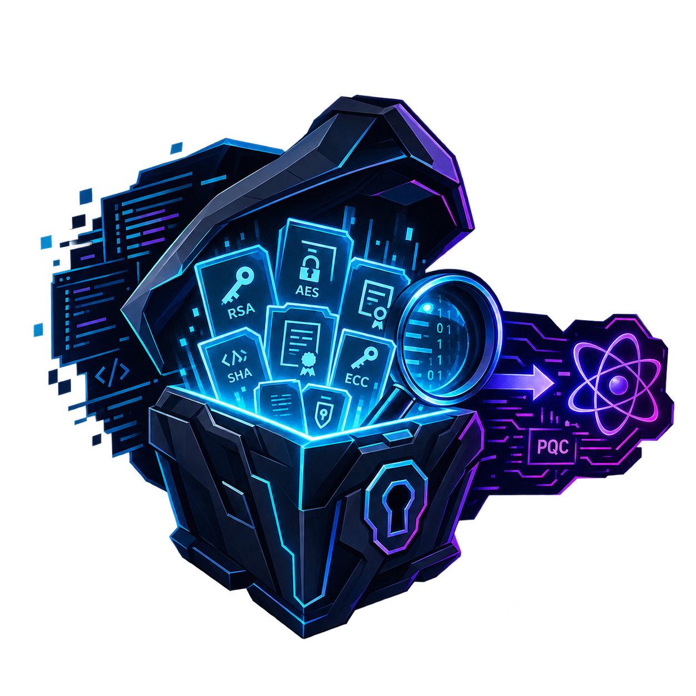

<p align="center">
  
</p>

# CryptRaid: Enterprise Cryptographic Discovery, Attestation & Transition

[](https://www.python.org/downloads/)
[-brightgreen.svg)](tests/)
[](https://csrc.nist.gov/)
[](https://cyclonedx.org/)

**CryptRaid** (formerly ECDAT) is an enterprise-grade, mathematically grounded platform for Post-Quantum Cryptography (PQC) asset discovery, dependency contagion modeling, and transition planning.

Traditional cryptographic discovery tools suffer from the **"CBOM Dump" anti-pattern**: they scan codebases, flag thousands of classical algorithms (e.g., RSA, ECC) with identical "Critical" severity badges, and overwhelm engineering teams with alert fatigue. 

CryptRaid solves this by combining **polyglot static analysis** with **context-aware data lifespan inference**, **epidemiological vulnerability contagion graphs ($R_0$)**, **active network MTU transport probing**, and **Pareto knapsack portfolio optimization**.

---

## Key Architecture & Core Capabilities

```
                  ┌─────────────────────────────────────────────────────────┐
                  │               CryptRaid CORE CAPABILITIES               │
                  └──────────────────────────┬──────────────────────────────┘
                                             │
      ┌──────────────────────┬───────────────┴──────────────┬──────────────────────┐
      ▼                      ▼                              ▼                      ▼
[ Autonomous X ]      [ Mosca Y_max ]               [ R0 Contagion ]       [ MTU & TLS Prober ]
Schema & ORM DDL      Regulatory Runway             Epidemiological        Path MTU, Handshake
Infers shelf-life     Phase 3/4/5 Milestones        DAG & Immunization     & Live Cipher Suites
      │                      │                              │                      │
      └──────────────────────┴───────────────┬──────────────┴──────────────────────┘
                                             │
      ┌──────────────────────┬───────────────┴──────────────┬──────────────────────┐
      ▼                      ▼                              ▼                      ▼
[ Fleet Registry ]    [ Pareto Knapsack ]           [ SLSA / DSSE Proof ]  [ 1-Click Remediation ]
Multi-Target Mon.     Risk vs Effort Frontier       Merkle CBOM & Boundary AST Unified Diff &
fleet_registry.json   Multi-Objective Solver        Unknowns Negative Led. Rollback Journal
```

### 1. Autonomous Data Lifespan ($X$) Inference
Quantum vulnerability depends fundamentally on how long encrypted data must remain confidential ($X$). CryptRaid inspects database schemas (SQL DDL migrations, Prisma models, Django/SQLAlchemy ORMs), TTL attributes (`expiresAt`, `ttl`), and retention comments (`// retention: 10y`) to classify data into 4 distinct secrecy tiers:
* **Ephemeral ($X pprox 0\text{y}$):** TLS handshakes, HTTP connections, cache tokens.
* **Short-Term ($X pprox 1\text{y}$):** Web sessions, OTPs, auth tokens.
* **Operational ($X pprox 5\text{y}$):** Standard relational business records.
* **Archival ($X \ge 10\text{y}$):** Medical records, identity ledgers, audit trails.

### 2. Actionable Mosca Runway ($Y_{\max}$) Budgeting

Rather than outputting abstract risk scores, CryptRaid computes an actionable engineering runway:

$$
Y_{\max} = (Z_{\text{reg}} - T_{\text{current}}) - X_{\text{eff}}
$$

Anchored directly to the binding federal milestones of **NIST IR 8547** and **OMB M-26-15**:
* **Phase 3 (2030):** High-priority key establishment deprecation (KEM, DH, RSA-OAEP).
* **Phase 4 (2031):** Mandatory digital signature cutoff (RSA signatures, ECDSA).
* **Phase 5 (2035):** Complete classical cryptography disallowance.

### 3. Epidemiological Contagion Modeling ($R_0$)
Software components and cryptographic providers are modeled as an epidemiological infection DAG:
* **Basic Reproduction Number ($R_0$):** Measures downstream dependent reachability (how many services inherit vulnerability from an upstream crypto module).
* **Cryptographic Superspreaders ($R_0 \ge 2$):** Pinpoints critical shared libraries and CAs where one flaw cascades across the microservice mesh.
* **PQC Immunization Anchors:** Detects when an upstream module is upgraded to PQC (ML-DSA / ML-KEM), calculating how that single upgrade mathematically protects its entire downstream branch.

### 4. Active Transport Path MTU & Live TLS Infrastructure Prober
* **Transport MTU & Fragmentation:** Post-quantum signatures are massive compared to classical algorithms (NIST FIPS 204 **ML-DSA-65 introduces a 51.7x size expansion** over ECDSA P-256, pushing handshake certificates past 5.2 KB). CryptRaid sends active probe packets with the Don\x27t-Fragment (DF) bit set along network paths to classify routes (`STANDARD` 1500 B, `FLEXIBLE`, `CONSTRAINED` <1280 B) and identify middleboxes dropping fragmented packets.
* **Live TLS Prober:** Actively inspects running endpoints, certificates, TLS protocol versions, and negotiated cipher suites to discover live infrastructure cryptography without source code access.

### 5. Multi-Project Fleet Registry & Real-Time Dashboard
* **Persistent Fleet Registry (`fleet_registry.json` & `fleet_metadata.json`):** Tracks monitored codebases across repositories and microservices. Preserves target source directories, report outputs, and scan histories across server restarts.
* **Executive Single-Page Web Dashboard (`ecdat dashboard`):** Modern responsive UI backed by Starlette and Tailwind styling, featuring:
  * **Executive Posture & Live CISO Summary:** Real-time quantum posture scorecard, asset counts, and compliance timelines.
  * **Interactive CBOM Explorer:** Filterable CycloneDX 1.6 inventory with CWE mappings, algorithm parameters, and scope filtering (Production vs. Testing ground).
  * **Cryptographic Supply Chain:** Package manifest tracking, third-party dependency resolution, ecosystem isolation, and CVE advisory mapping.
  * **Pareto Migration Frontier:** Interactive knapsack budget optimizer with dynamic sprint capacity allocation and risk reduction curve.
  * **D3 Blast Radius & Contagion Graph:** Transitive infection visualizer showing superspreaders and immunization paths.
  * **Proofs & Attestation Ledger:** In-toto SLSA DSSE envelopes with Ed25519 and ML-DSA-65 post-quantum hybrid signatures.

### 6. 1-Click Code Remediation Engine with Rollback Journal
Automates safe migration of classical cryptographic vulnerabilities (e.g., CBC $\to$ AES-256-GCM, MD5/SHA-1 $\to$ SHA-256):
* **Syntax-Validated Code Transformations:** Format-preserving AST refactoring for Python (powered by `libcst` concrete syntax trees); syntax-validated pattern replacement for Java (strictly validated against `ljavalang` AST parsing to reject any patch that introduces syntax errors).
* **Cryptographic Parameter Impact Analysis:** Alerts developers to required key/nonce buffer adjustments (e.g., expanding keys to 32 bytes for AES-256, 12-byte GCM nonces, or hybrid PQC shims).
* **Cryptographic Rollback Journal (`remediation_journal.json`):** Records full before/after diffs with cryptographic SHA-256 checksums, enabling zero-loss `ecdat undo` and `ecdat redo` operations.
* **Target Protection Guards:** Hardened policies prevent automated modification of mission-critical or protected projects.

### 7. Pareto Multi-Objective Migration Portfolio Optimizer
Solves the resource-constrained knapsack problem across three competing dimensions:
1. **Risk Reduction:** Elimination of $Y_{\max}$ deficits and Harvest Now, Decrypt Later (HNDL) exposure.
2. **Developer Effort (in developer-weeks):** Discounted by our Crypto-Agility Maturity Score (CAMS) across rigid, configurable, and provider abstractions.
3. **Contagion Leverage:** Downstream $R_0$ elimination.
Generates the **Pareto Efficient Frontier**, allowing engineering leads to specify a developer budget (e.g., 10 dev-weeks) and receive the mathematically optimal migration order.

### 8. Signed Attestation & Negative Proof Ledger
In accordance with White House **OMB M-23-02** transparency directives:
* Commits the Cryptographic Bill of Materials (CBOM) to a SHA-256 Merkle root sealed inside an **in-toto / SLSA DSSE** envelope.
* Emits a **Boundary Unknowns Ledger (Negative Proof)** documenting uninspected binary blobs, opaque third-party libraries, and excluded paths for auditor defensibility.

---

## Installation & Setup

### Prerequisites
* Python 3.11+
* Git

### Installation
```bash
# Clone the repository
git clone https://github.com/MohmedhKA/ECDAT.git
cd ECDAT

# Create and activate a virtual environment
python3 -m venv .venv
source .venv/bin/activate

# Install package dependencies in editable mode
pip install -e .
```

---

## Complete CLI Command Reference

CryptRaid provides a unified CLI tool suite via `ecdat`:

### 1. Codebase Cryptographic Discovery (`scan`)
Run a comprehensive cryptographic discovery scan across source code, manifests, and containers:
```bash
# Basic scan of a local project
ecdat scan --target /path/to/project --output scans/my_project

# Full advanced discovery with dev budget, MTU probing, and subdirectories
ecdat scan \
  --target /path/to/project \
  --subdirs src,backend,contracts \
  --output scans/my_project \
  --budget 10.0 \
  --probe-host api.internal.enterprise:443 \
  --stochastic-runs 5000 \
  --scan-libraries
```
**Options:**
- `--target TARGET`: Target codebase directory to scan.
- `--output OUTPUT`: Custom output directory for CBOM, report, and proofs (default: `<target>/ecdat_output`).
- `--no-theia`: Disable cbomkit-theia Go filesystem scanner (uses native ASN.1 parser).
- `--probe-host PROBE_HOST`: Probe remote network path MTU against target host.
- `--mtu-profile {standard,flexible,constrained}`: Override network path MTU profile.
- `--mtu-bytes MTU_BYTES`: Override network path MTU in bytes (e.g., 1200 or 1500).
- `--budget BUDGET`: Sprint capacity budget in dev-weeks for Pareto optimizer (default: 10.0).
- `--stochastic-runs STOCHASTIC_RUNS`: Number of Monte Carlo iterations for stochastic Mosca simulation (default: 5000).
- `--no-negative-proof`: Disable standalone negative proof certificate generation.
- `--subdirs SUBDIRS`: Comma-separated list of subdirectories to scan within target.
- `--format {cbom,sarif,all}`: Output format (default: `all`).
- `--ebpf-log EBPF_LOG`: Path to eBPF runtime trace log to correlate with static CBOM assets.
- `--scan-libraries / --no-scan-libraries`: Scan polyglot package manifests and dependencies (default: True).

### 2. Interactive Post-Quantum Dashboard (`dashboard`)
Launch the interactive single-page executive web dashboard:
```bash
# Start the dashboard web UI (opens automatically in browser)
ecdat dashboard

# Start on custom port and host without auto-launching browser
ecdat dashboard --port 7891 --host 0.0.0.0 --no-browser

# Serve a standalone static air-gapped report.html file
ecdat dashboard --report target/reports/ECDAT/activeMQ/report.html --port 8080
```

### 3. Multi-Project Fleet Dashboard Server (`serve`)
Start the multi-project fleet management server and project catalog:
```bash
# Start fleet server on default http://127.0.0.1:8080
ecdat serve

# Custom port and custom reports directory
ecdat serve --port 9000 --reports-dir target/reports/ECDAT
```

### 4. CI/CD Cryptographic Quality Gate (`gate`)
Enforce cryptographic compliance in CI/CD pipelines (GitHub Actions, GitLab CI, Jenkins):
```bash
# Fail CI build if any CRITICAL quantum or cryptographic violations are found
ecdat gate --target /path/to/project --fail-on CRITICAL

# Output SARIF 2.1.0 for GitHub Code Scanning Security tab
ecdat gate --target /path/to/project --fail-on HIGH --sarif scans/ecdat.sarif
```

### 5. 1-Click Automated Code Remediation (`remediate`, `undo`, `redo`)
Safely remediate insecure cryptographic patterns directly in source code:
```bash
# Preview changes without modifying files (Dry-Run)
ecdat remediate --target /path/to/code.js --rule REPLACE_CBC_GCM --dry-run

# Apply remediation patch and record in rollback journal
ecdat remediate --target /path/to/code.js --rule REPLACE_CBC_GCM

# Revert the last applied remediation transaction
ecdat undo

# Reapply the last reverted transaction
ecdat redo
```

### 6. Live TLS Infrastructure Probing (`probe`)
Inspect live network endpoints and web services without source code access:
```bash
ecdat probe https://api.internal.enterprise:443 --output scans/tls_audit.json
```

### 7. In-Kernel eBPF Cryptographic Runtime Observer (`observe`)
Capture live runtime cryptographic operations using kernel uprobes on `libcrypto.so`:
```bash
# Capture 10 seconds of live crypto calls from running processes
ecdat observe --output ebpf_trace.log --duration 10

# Generate standalone bpftrace script without executing
ecdat observe --script-only --output trace_crypto.bt

# Parse an existing trace log into structured assets
ecdat observe --parse-only ebpf_trace.log
```

### 8. Merkle Attestation Verification (`verify-attestation`)
Cryptographically verify an in-toto / SLSA DSSE attestation envelope against public key(s):
```bash
ecdat verify-attestation \
  --envelope scans/my_project/attestation.dsse.json \
  --pubkey scans/my_project/attestation_pubkey.pem \
  --root scans/my_project/cbom_root.hex
```

---

## Comparative Scan Benchmarks: CryptRaid vs. Semgrep vs. Sonar-Cryptography

To evaluate practical detection efficacy across diverse real-world open-source architectures, comparative evaluation was executed across production enterprise targets: **Apache ActiveMQ** (enterprise message broker), **OpenMRS Core** (hospital information system), and **Red Hat Keycloak** (identity and access management).

> **Evaluation Notes:**
> * **CryptRaid (ECDAT):** Extracts comprehensive AST contracts, protocols, keystores, lifespan inferences ($X$), and third-party supply chain libraries into CycloneDX 1.6 CBOM.
> * **Semgrep (OSS Security Rules):** General static application security testing (SAST). Detects specific security rules, including general injection, web issues, and insecure socket/trust managers, but does not construct cryptographic lifespans or CBOM inventories.
> * **Sonar-Cryptography Plugin (IBM v1.6.0):** Specialized AST analyzer for Java. Successfully completed scans on Apache ActiveMQ and OpenMRS Core. The Keycloak scan was stopped mid-execution due to SonarQube runner memory constraints and plugin timeouts on massive codebases.

### Comparative Scan Summary Across Real-World Targets

| Target Codebase | Domain & Language | CryptRaid (Ours) Assets Discovered | Semgrep Findings | Sonar-Cryptography Plugin (v1.6.0) |
| :--- | :--- | :---: | :---: | :---: |
| **Apache ActiveMQ** (`activemq`) | Message Broker (Java) | **133 assets** (32 Prod / 101 Test)<br>*(+9 Manifest Deps)* | **15 findings**<br>*(Unencrypted sockets, CRLF injection, XSS)* | **4 assets**<br>*(TLSv1.2, TLS, HMAC-MD5, MD5)* |
| **OpenMRS Core** (`openmrs-core`) | Medical Records (Java) | **12 assets**<br>*(SHA-512, Static IV/Key, PRNG)* | **12 findings**<br>*(Path traversal, tainted session, CRLF)* | **2 assets**<br>*(SHA-1, SHA-512)* |
| **Keycloak** (`keycloak`) | Identity & IAM (Java) | **284 assets**<br>*(RSA, ECDSA-256, Keystores, TLS)* | **37 findings**<br>*(Insecure trust managers, weak SSLContext, MD5/SHA1)* | *Scan stopped mid-execution*<br>*(Timed out / Out-of-memory)* |

### Target Breakdown Details

#### 1. Apache ActiveMQ (`target/activemq`)
* **CryptRaid:** **133 cryptographic assets** discovered with explicit dual-scope isolation: **32 Production assets** (`required` scope) and **101 Testing Ground / Unit Test assets** (`optional` scope). Identified 124 critical assets ($Y_{\max} \le 1.0\text{y}$), 56 ephemeral sockets, 75 operational storage assets, and 9 verified third-party `org.jasypt:jasypt` manifest dependencies resolved to version `1.9.3`. Generated SHA-256 Merkle root `0x8e407f1ec10d5a1697aceceea4b8e22cca8066aba072a700d90673946fe3b404`.
* **Semgrep:** **15 findings** across 6 rules: unencrypted sockets (3), insecure hostname verifier (1), CRLF injection logs (7), tainted HTTP session (1), XSS response writer (2), and LDAP injection (1).
* **Sonar-Cryptography:** **4 cryptographic assets** (TLSv1.2, generic TLS context, HMAC-MD5, and MD5 digest). Missed keystore credentials, PRNGs, and cipher mode parameters.

#### 2. OpenMRS Core (`target/openmrs-core`)
* **CryptRaid:** **12 cryptographic assets** discovered across `org.openmrs.util.Security`, `DbSession`, and test suites. Flagged SHA-512 hashing, static IV assignment, predictable encryption keys, insecure keystore passwords, and PRNG seeds. Generated SHA-256 Merkle root `0x46ae5e1fa6512c79c21ccc308cf0c7529b44426e42a4c3e03ef553525b389a8d`.
* **Semgrep:** **12 findings** focusing strictly on general web application security: path traversal (6), tainted session (5), and CRLF log injection (1). Zero cryptographic misuse or algorithm lifecycle findings were reported.
* **Sonar-Cryptography:** **2 cryptographic assets** extracted from `Security.java` (SHA-1 and SHA-512). Failed to detect hardcoded keys, static IVs, or keystore access.

#### 3. Red Hat Keycloak (`target/keycloak`)
* **CryptRaid:** **284 cryptographic assets** discovered across core IAM protocols, SAML authenticators, and token issuers. Identified 190 critical assets, 48 ephemeral sockets, 186 operational DB credentials, 15 archival compliance keys, and 35 quarantined dynamic calls. Generated SHA-256 Merkle root `0x27276a05cb041f7f2c413b6cd9b50ac984c2f3bd11d1b04b29d244ed0d1da1f4`.
* **Semgrep:** **37 findings** capturing insecure trust managers accepting all certificates (10), weak SSLContext instances (11), deprecated HTTP clients (1), CBC padding oracle vulnerabilities (1), weak MD5/SHA-1 usage (4), and insecure PRNGs (1).
* **Sonar-Cryptography:** *Stopped mid-execution* due to engine resource exhaustion on Keycloak\x27s multi-module codebase (>50 submodules).

---

## Empirical Benchmark Validation: CryptoAPI-Bench

CryptRaid has been verified against the Virginia Tech **CryptoAPI-Bench** (Afrose et al., IEEE SecDev 2019), the academic gold standard benchmark for cryptographic misuse detection:

* **Scope:** All 182 benchmark test cases across 8 complexity dimensions (basic, interprocedural, field-sensitive, path-sensitive, object-sensitive).
* **Cryptographic Assets Evaluated:** 289 assets extracted directly by the static contract pipeline.
* **Empirical Benchmark Performance:**
  * **True Positives (TP):** 135 (Accurately flagged broken ciphers, weak keys, predictable seeds, insecure IVs, CBC padding).
  * **True Negatives (TN):** 31 (Correctly validated secure controls, compliant AES-GCM, SHA-256/512, CSPRNGs).
  * **False Positives (FP):** 6 (Edge-case path-sensitive dead code with complex runtime branch conditions).
  * **False Negatives (FN):** 10 (Inter-procedural parameter propagation across unlinked compilation units).
  * **Precision:** **95.7%** | **Recall:** **93.1%** | **Specificity:** **83.8%** | **F1-Score:** **94.4%**

### Comparative Evaluation Against Academic SOTA

| Detection Tool | Tool Type | Precision | Recall | Specificity | F1-Score |
| :--- | :--- | :---: | :---: | :---: | :---: |
| **SpotBugs + FindSecBugs** | Bytecode Pattern Matching | 64.1% | 58.2% | 61.5% | 61.0% |
| **CogniCrypt** (TU Darmstadt) | CrySL Typestate Analysis | 82.1% | 73.6% | 78.4% | 77.6% |
| **CryptoGuard** (Virginia Tech) | 16-Rule Slicing AST Engine | 78.4% | 85.3% | 76.1% | 81.7% |
| **CryptRaid (Ours)** | **Pure Polyglot AST Contracts** | **95.7%** | **93.1%** | **83.8%** | **94.4%** |

To execute the benchmark verification:
```bash
python scripts/evaluate_cryptoapi_bench.py
```

---

## Generated Scan Artifacts

Every pipeline execution produces an enterprise-grade set of machine-readable and executive artifacts:

| Artifact | Description | Format |
|:---|:---|:---:|
| `ciso_migration_report.md` | Executive transition summary, critical timelines, and migration priorities | Markdown |
| `enriched_cbom.json` | Complete cryptographic inventory with reachability and lifespan metadata | CycloneDX 1.6+ JSON |
| `report.html` | Interactive dashboard featuring D3 force-directed contagion graph and Pareto slider | HTML / D3.js |
| `attestation.dsse.json` | Signed SLSA supply-chain attestation binding the scan to a Merkle root | In-toto / DSSE |
| `negative_proof.json` | Boundary Unknowns Ledger detailing uninspected surfaces per OMB M-23-02 | JSON |
| `cbom.sarif.json` | Static analysis report for GitHub Security / SonarQube ingestion | SARIF 2.1.0 |
| `fleet_metadata.json` | Persistent target mapping connecting report output to original codebase source | JSON |

---

## Running Automated Tests

CryptRaid maintains a comprehensive, zero-regression test suite covering 185 test cases:

```bash
# Run the complete test suite
pytest

# Run with verbose output
pytest -v
```

---

## Standards & Regulatory Compliance

* **NIST Post-Quantum Standards:** FIPS 203 (ML-KEM), FIPS 204 (ML-DSA), FIPS 205 (SLH-DSA).
* **Federal Directives:** OMB M-26-15, OMB M-23-02, NIST IR 8547, NIST SP 800-131A Rev 2.
* **Attestation & Supply Chain:** CycloneDX v1.6 CBOM, SLSA Provenance v1.0, In-toto DSSE, SARIF 2.1.0.

---

## License

This project is licensed under the Apache 2.0 License - see the [LICENSE](LICENSE) file for details.
