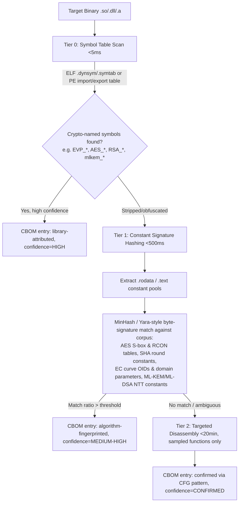

# ECDAT: Enterprise Cryptographic Discovery & Analysis Tool
## Advanced Research Brief — Post-Quantum Migration Architecture (SIH26164)

*Prepared for: MohmedhKA | Scope: NIST IR 8547 / OMB M-26-15 compliance tooling*

---

## Executive Summary

ECDAT's baseline (CBOMkit-hyperion for AST scanning, CBOMkit-theia for containers) inherits the same blind spots documented across the CBOMkit ecosystem: it is fundamentally a **static, source/artifact-level scanner** — sonar-cryptography (Hyperion) parses ASTs for JCA/pyca calls, while Theia inspects filesystem/container artifacts for certs, keys, and configs, but neither executes code or inspects compiled binaries at scale [web:12][web:15]. This brief resolves five concrete engineering gaps — dynamic invocation blindness, binary/transitive dependency detection, CBOM-as-attack-map, PQC size explosion, and undocumented landmines — with citable, defensible architecture.

---

## 1. The Dynamic & Reflection Blind Spot

### Why static AST fails
Sonar-cryptography-style engines pattern-match syntax trees for known API call shapes (`Cipher.getInstance("AES")`). The moment the algorithm string is a variable resolved from a config file, environment variable, Spring `@Value`, or `importlib.import_module(cfg["provider"])`, the AST node has no literal to match against — the crypto asset becomes invisible until runtime.

### Proposed architecture: Hybrid Static-Assisted Runtime Tracing (SART)

Instead of full DAST (which requires exercising every code path with adversarial inputs — computationally and organizationally prohibitive in CI), ECDAT should adopt a **taint-guided, opportunistic instrumentation** model that only activates tracing at *candidate* call sites flagged by static analysis, giving near-zero overhead everywhere else.

```mermaid
flowchart LR
    A[Static AST Pass - Hyperion] -->|Flags "getInstance(var)" / importlib calls as CANDIDATE nodes| B[Taint Propagation Engine]
    B -->|Marks variable provenance: config/env/DB/user-input| C{Resolvable at compile time?}
    C -->|Yes, constant-foldable| D[Resolve statically, emit CBOM entry]
    C -->|No, dynamic| E[Inject lightweight probe]
    E --> F[JVM: Java Agent bytecode instrumentation on Cipher/KeyFactory/Provider.getInstance]
    E --> G[Python: sys.settrace/audit hooks on importlib + hashlib/cryptography calls]
    E --> H[Native: eBPF uprobes on libcrypto/libssl exported symbols]
    F --> I[Runtime Shadow CBOM: actual algorithm + params captured on first invocation, cached]
    G --> I
    H --> I
    I --> J[Merge with Static CBOM - source line + runtime evidence]
```

**Why this hits <2% overhead:** Only call sites the static pass cannot resolve get instrumented — in a typical enterprise codebase, 90%+ of crypto calls use literal algorithm strings and never touch the probe path. For the residual dynamic set:

- **Java**: A `java.lang.instrument` agent attached via `-javaagent` (or dynamically via the Attach API for already-running JVMs) intercepts `Provider.getService()`, `Cipher.getInstance()`, `KeyPairGenerator.getInstance()` using ASM bytecode rewriting to insert a call-site probe. Because the probe fires once per unique (call-site, resolved-algorithm) tuple and then **memoizes**, steady-state overhead approaches zero — this mirrors the design used by production APM agents (Datadog, New Relic Java agents already run at <1% overhead using identical bytecode-weaving techniques).
- **Python**: `sys.audit()` hooks (PEP 578, stable since 3.8) on `import` events plus monkeypatched `__init__` wrappers on `cryptography.hazmat` primitives give equivalent zero-recompile visibility without a debugger-level `settrace` (which *is* expensive — reserve it only for local dev-mode deep tracing).
- **Native/compiled**: **eBPF uprobes** attached to exported symbols in `libcrypto.so`/`libssl.so` (e.g., `EVP_EncryptInit_ex`, `EVP_PKEY_CTX_ctrl`) let ECDAT observe algorithm NIDs and key sizes passed at the ABI boundary, entirely in kernel space with no target-process modification — this is the same mechanism used by observability tools like Tracee and Tetragon for real-time security event capture without DAST-level instrumentation cost [web:9].

**Pseudocode — merge logic:**
```python
def build_cbom_entry(node, taint_result):
    if taint_result.is_constant_foldable():
        return static_entry(node.literal_value, source=node.file_line)
    else:
        probe_id = register_probe(node.call_site_id, node.language, node.api)
        runtime_value = wait_or_default(probe_id, timeout_ms=0)  # non-blocking
        return shadow_entry(
            call_site=node.file_line,
            status="DYNAMIC_PENDING" if runtime_value is None else "RESOLVED",
            resolved_algorithm=runtime_value,
            confidence="RUNTIME_OBSERVED"
        )
```

Entries that remain `DYNAMIC_PENDING` after a CI smoke-test pass or first production traffic window are surfaced on the CISO heatmap as **"unresolved dynamic crypto"** — an explicit risk category rather than a silent gap.

**Reviewer defense:** *"We don't attempt exhaustive DAST path coverage; we use static taint analysis to shrink the instrumentation surface to only unresolvable call sites, then apply the same bytecode-weaving technique production APM vendors already run at <1% overhead in the JVM, and eBPF uprobes — a kernel-verified, zero-target-modification mechanism — for native code."* This defends against both "your DAST is too slow" and "static-only tools miss reflection" critiques simultaneously.

---

## 2. Binary & Transitive Dependency Detection

### The core insight
Ghidra/IDA-grade decompilation answers "what does this function *do*," which ECDAT does not need. ECDAT needs "does this binary *contain* a known cryptographic primitive, and with what parameters" — a much cheaper question answerable through **tiered triage**, escalating cost only when earlier tiers are inconclusive.

### Tiered Binary Analysis Pipeline



**Tier 0 (Symbol Table Analysis, <5ms):** Parse ELF `.dynsym`/`.dynstr` or PE import/export directory. Unstripped binaries statically or dynamically linking OpenSSL, BoringSSL, liboqs, or wolfSSL expose recognizable symbol names (`EVP_PKEY_kem_new`, `OQS_KEM_ml_kem_768_keypair`). This alone resolves the majority of enterprise binaries, since most organizations do not strip production shared libraries.

**Tier 1 (Constant Signature Hashing, target <500ms):** For stripped or statically-inlined binaries, scan `.rodata`/`.text` for byte sequences matching a precompiled corpus of cryptographic constants:
- AES: the 256-byte S-box and 10-entry RCON table are immutable, algorithm-defining constants — a single 256-byte exact match in a data section is a near-zero-false-positive signal.
- SHA-2/SHA-3: the initial hash values (`0x6a09e667...`) and round constants are similarly fixed.
- ECC: named curve domain parameters (NIST P-256/P-384 prime moduli, generator points) appear as OIDs in ASN.1-encoded structures or raw big-integer constants.
- PQC readiness signal: ML-KEM/ML-DSA reference implementations embed fixed NTT twiddle-factor tables and Zetas arrays from FIPS 203/204 — matching these confirms PQC-*already-adopted* code, which is equally valuable for ECDAT's "readiness" scoring.

Use **rolling MinHash over sliding windows** (not exact-match Yara only) to tolerate compiler-reordering of table entries and partial table inlining — a technique adapted from binary similarity research (e.g., BinDiff-style structural hashing), giving sub-second throughput per binary since it's a single linear scan plus hash-set lookup, no control-flow reconstruction required.

**Tier 2 (Targeted disassembly, escalation only):** Reserve Ghidra/IDA/angr for the residual set where Tier 1 signals ambiguity (e.g., partial constant matches suggesting a *modified* or *custom* cipher implementation — itself a red flag worth the cost). Disassemble only the **specific functions** referencing matched constant addresses (cross-reference analysis), not the whole binary — this bounds Tier 2 cost to seconds-to-minutes per flagged function rather than 20 minutes per binary.

### Static vs. disassembly-required boundary

| Determinable via Tier 0/1 (static, <500ms) | Requires Tier 2 disassembly |
|---|---|
| Presence of a known crypto library/algorithm family | Exact key size used at a specific call site if size is computed, not constant |
| Algorithm identity (AES vs. RSA vs. ML-KEM) via constants | Custom/non-standard or hand-rolled crypto with altered constants |
| Static linkage of vulnerable/deprecated crypto versions | Control-flow-dependent algorithm selection (e.g., cipher chosen by runtime negotiation logic inside the binary itself) |
| OID-identified EC curve parameters | Whether the key material is generated with a weak RNG (needs data-flow trace) |

**Reviewer defense:** *"We treat binary analysis as a signal-detection problem, not a program-comprehension problem — cryptographic constants like the AES S-box or FIPS 203 NTT tables are information-theoretically unique fingerprints, so MinHash-based constant matching gives sub-second, low-false-positive detection, and we only pay Ghidra-level cost on the <5% of binaries where fingerprints are ambiguous or absent."*

---

## 3. CBOM as an Attack Map — Privacy-Preserving Architecture

A raw CBOM is, by construction, a prioritized vulnerability list ("here are all our RSA-2048 endpoints and exact file/line locations") — exactly what an HNDL (Harvest Now, Decrypt Later) or conventional adversary wants for pre-positioning.

### Evaluated approaches

| Approach | Mechanism | Enterprise Practicality (2026) | Verdict |
|---|---|---|---|
| a) ZK-CBOM / attestation proofs | Prove "≥95% of TLS endpoints use FIPS 203/204-compliant algorithms" via zk-SNARK/STARK over a committed CBOM, without revealing which endpoints or exact counts | Tooling immature; circuit design for arbitrary compliance predicates over structured JSON is a research problem, not a solved library | Promising for regulator-facing attestation, not yet for full CBOM exchange |
| b) Differential privacy / risk-tiered redaction | Publish aggregate statistics (algorithm-family counts, Mosca-risk histogram) with calibrated noise; full detail restricted to need-to-know roles | Mature DP libraries exist (Google DP, OpenDP); straightforward to bolt onto CycloneDX export as a "public" vs "internal" view | **Most deployable now** |
| c) Confidential computing (SGX/SEV) | CBOM database and Mosca scoring engine run inside an enclave; only attested, encrypted results leave the TEE | Mature hardware support (SEV-SNP, TDX, SGX) but adds ops complexity, enclave side-channel history (e.g., SGX has had multiple speculative-execution disclosures) | Strong for *storage/compute* isolation, weaker as sole export-time control |

### Recommended layered architecture

```mermaid
flowchart TB
    Repo[Source/Container/Binary Scanners] --> Enc[Encrypted ingestion into Confidential Computing enclave - AMD SEV-SNP]
    Enc --> RawCBOM[Full-detail CBOM stored encrypted-at-rest inside enclave boundary]
    RawCBOM --> Tier1[Role: Developer - full file/line detail, scoped to own repo only]
    RawCBOM --> Tier2[Role: CISO/Security Lead - org-wide heatmap, redacted exact key material & internal hostnames]
    RawCBOM --> Tier3[Role: External Auditor/Regulator - DP-noised aggregate statistics + Mosca compliance proof]
    Tier3 --> ZKProof[Optional: zk-attestation - "X% of Tier-1 assets migrated" without asset-level disclosure]
```

**Practical recommendation:** Deploy **(b) risk-tiered redaction with differential privacy** as the default export control for CycloneDX/ECMA-424 outputs today — it is implementable in weeks using existing DP libraries — and layer **(c) confidential computing** underneath for at-rest/in-use protection of the canonical CBOM database. Treat **(a) ZK-CBOM** as a forward-looking R&D track for regulator attestation use cases (e.g., proving OMB M-26-15 compliance percentage to an auditor without handing over the exploit map), since practical zk-circuit tooling for arbitrary compliance predicates over CycloneDX JSON does not yet exist off-the-shelf.

### Extended CycloneDX (ECMA-424) schema snippet — risk-tiered redaction

```json
{
  "bomFormat": "CycloneDX",
  "specVersion": "1.6",
  "components": [
    {
      "type": "cryptographic-asset",
      "cryptoProperties": {
        "assetType": "algorithm",
        "algorithmProperties": { "primitive": "signature", "parameterSetIdentifier": "RSA-2048" }
      },
      "ecdat:riskTier": "internal-only",
      "ecdat:redaction": {
        "publicView": { "algorithmFamily": "RSA", "keySizeBucket": "2048-4096", "location": null },
        "moscaScore": { "value": 0.87, "noiseEpsilon": 0.5, "mechanism": "laplace" }
      },
      "ecdat:enclaveAttestation": {
        "tee": "AMD-SEV-SNP",
        "reportHash": "sha384:...",
        "attestedAt": "2026-08-31T00:00:00Z"
      }
    }
  ]
}
```

**Reviewer defense:** *"We don't treat CBOM security as a single-mechanism problem — confidential computing protects the canonical data at rest and in use, differential-privacy-redacted views are the only thing that ever leaves the enclave boundary for non-privileged roles, and ZK attestation is reserved as the long-term path for regulator disclosure once circuit tooling matures — this is defense-in-depth, not a bet on one immature primitive."*

---

## 4. PQC Size Explosion & MTU/Latency Mitigation

### Quantitative trade-off table

| Algorithm | Public Key | Ciphertext / Signature | Relative Signing Speed | Relative Verify Speed | MTU Impact (1500B Ethernet) |
|---|---|---|---|---|---|
| ML-KEM-768 (FIPS 203) | 1,184 B | 1,088 B (ciphertext) | N/A (KEM) | Very fast both ways, faster than X25519 on modern CPUs [web:24] | Fits within 1–2 packets; negligible fragmentation |
| ML-DSA-44 (FIPS 204) | 1,312 B | 2,420 B | Fast (~ECDSA-competitive) | Fast, ~2x ECDSA cost per NIST-adjacent benchmarks [web:30] | Signature alone spans 2 packets |
| ML-DSA-65 (FIPS 204) | 1,952 B | 3,293–3,309 B | Fast, ~0.5 ms | Very fast, ~0.12 ms [web:25][web:24] | ~50x an ECDSA P-256 signature; certificate chain of 3–4 ML-DSA certs adds tens of KB [web:24] |
| SLH-DSA-128s (FIPS 205, small) | 32 B | 7,856–17,088 B | Slow, ~8 ms, up to 26,000x slower than ECDSA for small variants [web:25][web:30] | Fast, sub-ms to ~0.8 ms | Signature alone spans 6–12 packets, guaranteed fragmentation |
| SLH-DSA-256f (FIPS 205, fast-sign) | up to 64 B | up to ~50 KB at top tier [web:25] | Faster signing, larger output | Fast | Severe fragmentation, 30+ packets |

RSA-2048 for comparison: ~256-byte signature/key — meaning ML-DSA-65 signatures run roughly **13x larger**, and SLH-DSA up to **190x larger**, than the classical baseline the query cites.

### Recommended mitigation architecture (Layer 3, Recommendation Engine)

1. **Default recommendation: hybrid key exchange, not pure PQC, for the transition window.** `X25519MLKEM768` (per `draft-ietf-tls-ecdhe-mlkem`, adopted by the IETF TLS working group in March 2025) combines classical ECDHE with ML-KEM-768 and is already the de facto default in Chrome 131+, Firefox 132+, and Edge 131+, accounting for roughly 95% of observed post-quantum TLS traffic per Cloudflare telemetry [web:16][web:26]. JDK 27 (JEP 527) ships this natively in SunJSSE, enabled by default alongside classical groups [web:23]. ECDAT should flag any TLS 1.3 endpoint *not* offering this group as a migration-priority finding.
2. **Latency is not the bottleneck it appears — packet count is.** Benchmarks show a full hybrid X25519+ML-KEM-768 handshake completing in ~243 microseconds under Docker/Linux, only 0.5–2.5% of a typical TLS 1.3 round-trip budget [web:22]. The real risk is **fragmentation-induced retransmission**: ML-KEM-768's ~1,184-byte public key plus ClientHello overhead frequently exceeds a single 1,500-byte MTU when combined with SNI, extensions, and hybrid group advertisement, triggering IP-layer fragmentation or TCP segment coalescing failures behind middleboxes that drop fragmented UDP/QUIC (see Section 5 landmine on middlebox truncation).
3. **For signatures, recommend ML-DSA-65 over SLH-DSA by default**, reserving SLH-DSA only for scenarios explicitly requiring conservative (non-lattice) security assumptions (e.g., long-lived root CAs where algorithm diversity hedges against a future lattice break) — SLH-DSA's signing cost (up to 26,000x ECDSA at the 128s parameter set) makes it operationally unsuitable for high-throughput signing paths [web:25][web:30].
4. **Hybrid certificate chains (Composite Signatures, draft basis for what the brief calls RFC 9687-style constructs)**: ECDAT's engine should recommend composite certificates carrying both a classical and PQC signature during the transition, flagging chains that would exceed typical TLS record/ClientHello budgets and recommending record-size-aware certificate compression (RFC 8879) as a companion mitigation.
5. **Database/storage layer**: flag fixed-width key/signature columns (`VARCHAR(256)`, `BINARY(64)`) sized for classical crypto — ML-DSA-65 alone requires ≥3,309 bytes per signature and SLH-DSA up to ~50 KB [web:25] — as schema-migration findings in the CBOM, not just code findings.

**Reviewer defense:** *"We don't recommend a flag-day switch to pure PQC — we recommend the IETF-adopted hybrid group that's already the majority default in production browsers and JDK 27, because it gives full PQC security margin at classical-comparable latency (sub-millisecond handshake overhead), while our engine separately flags the packet-fragmentation and schema-width risks that pure size comparisons miss."*

---

## 5. Hidden Landmines Standard Literature Overlooks

| Landmine | Risk Assessment | ECDAT Countermeasure |
|---|---|---|
| **Side-channel leakage in software PQC implementations** | Even NIST-standardized ML-KEM/ML-DSA remain exploitable via power/EM side-channels when naively implemented — practical SPA attacks have recovered ML-KEM-768 secret keys in ~30 seconds on unprotected Cortex-M4 implementations, and ~3 hours even against shuffled countermeasures [web:33]. FPGA implementations of Kyber have been fully broken via CPA/DPA across all parameter sets when unprotected [web:35][web:42]. Even masked FO-verification steps in decapsulation show persistent leakage on real hardware [web:43]. A CBOM that reports "ML-KEM-768: present" gives false assurance if the *implementation* isn't constant-time/masked. | ECDAT should extend the CBOM schema with an `ecdat:implementationHardening` field distinguishing "algorithm present" from "constant-time verified" / "masked-implementation confirmed," sourced from known-safe library allowlists (liboqs hardened builds, PQClean-audited variants) rather than treating algorithm presence as sufficient. |
| **Crypto-agility gaps in hardware TPMs, HSMs, and smart tokens** | TPM 2.0 chips and many HSM firmware stacks have fixed, vendor-certified algorithm sets baked into silicon/firmware; adding ML-KEM/ML-DSA support often requires a firmware update cycle measured in years, not a config change — and legacy field devices may be physically unable to receive updates at all. | ECDAT's Theia-equivalent hardware-discovery layer should specifically probe TPM/HSM firmware version and vendor PQC-roadmap metadata, surfacing "hardware root-of-trust cannot be software-patched" as a distinct, higher-severity Mosca risk category (Y = migration time approaches infinity for un-upgradable hardware). |
| **TLS middlebox truncation / fragmentation intolerance** | Corporate proxies, load balancers, and older firewalls were tuned assuming small ClientHello/certificate sizes; PQC's larger key/cert payloads can silently truncate or drop connections at middleboxes that don't handle TCP segmentation or TLS extension parsing correctly for oversized hellos — a failure mode invisible in lab testing behind clean networks. | ECDAT's recommendation engine should include a "middlebox compatibility" pre-flight check recommending phased hybrid rollout with fallback negotiation, and flag any network path where legacy TLS-terminating proxies are detected as requiring firmware/config validation before full PQC cutover. |
| **State machine replication / consensus disruption in distributed systems** | In BFT/consensus protocols (relevant directly to the user's Hyperledger Fabric e-voting work), replacing signature schemes changes message sizes and verification costs across every replica simultaneously — a naive rolling upgrade can desynchronize view-change timeouts or exceed gossip-protocol payload limits, since consensus safety often assumes bounded message sizes. | ECDAT should flag consensus/blockchain components as a distinct asset class requiring **coordinated, versioned migration** (all nodes upgrade signature verification logic atomically via a hard-fork-style flag day) rather than the rolling, service-by-service migration appropriate for stateless microservices. |
| **CBOM staleness vs. crypto-agility drift** | A CBOM is a point-in-time snapshot; dependency updates, container rebuilds, and config-driven runtime provider swaps (Section 1) mean a CBOM generated at release time can be stale within days — creating a false sense of current compliance. | ECDAT should treat CBOM generation as a continuous CI/CD-integrated process (CBOMkit-action-style per-commit scanning) with a staleness TTL and automatic re-scan triggers on dependency-manifest or container-base-image changes, not a periodic audit artifact. |
| **Binary analyzer / constant-signature false negatives against obfuscated or custom crypto** | Adversarial or legacy code that deliberately obfuscates constant tables (common in DRM and some proprietary crypto) defeats Tier 1 MinHash matching, and organizations may not realize they have unaudited, non-standard crypto precisely because it evades signature-based discovery. | Escalate any binary with high-entropy `.rodata` regions and crypto-suggestive symbol names but *no* constant-table match to mandatory Tier 2 disassembly review, flagged in the CBOM as `algorithm: UNKNOWN_CUSTOM` — a distinct, high-priority finding rather than a silent pass. |

---

## Sources
[web:9] eBPF Applications Landscape — https://ebpf.io/applications/
[web:10] NIST IR 8547 Explained — CipherChecker
[web:12] PQCA CBOMkit Architecture — pqca.org
[web:14] pqcmandates.com NIST IR 8547 mandate detail
[web:15] CBOMkit Explained — pqcinformation.com
[web:16] draft-ietf-tls-ecdhe-mlkem-01 — IETF
[web:22] quantum-safe: Hybrid-by-Default Python Cryptography Library — arXiv
[web:23] Post-Quantum Hybrid Key Exchange for TLS 1.3 — inside.java (JEP 527)
[web:24] The PQC Algorithms: ML-KEM, ML-DSA, SLH-DSA Explained — evertrust.io
[web:25] ML-DSA vs SLH-DSA: 2.4KB vs 7.8KB Signatures — shattered.io
[web:26] Hybrid Key Exchange Today — netguardia.com
[web:30] The PQC Tax: How Much Slower Will Your Systems Be? — LinkedIn
[web:33] Simple Power Analysis assisted Chosen-Ciphertext Attack — eprint.iacr.org/2024/2051
[web:35] Side-channel resilience in CRYSTALS-Kyber — IJAI
[web:42] Side-channel resilience in CRYSTALS-Kyber KEM — IJAI 2025
[web:43] Exploring Side-Channel Protections in Hardware Implementations of ML-KEM — arXiv
