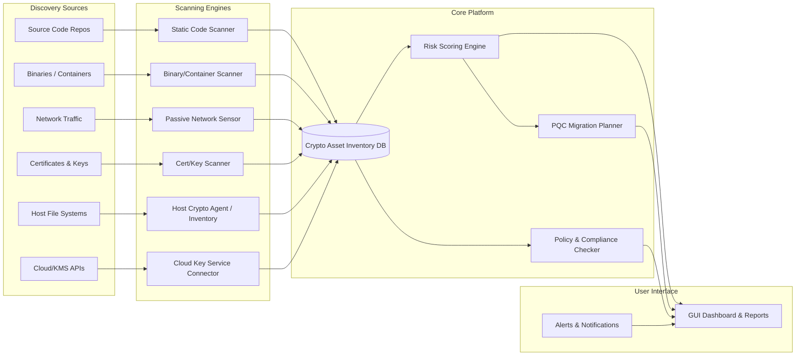

# Executive Summary

Cryptographic inventory and analysis tools have become critical as organisations prepare for **post-quantum cryptography (PQC)**. Leading solutions combine static code scanning, network monitoring, endpoint agents, and cloud/PKI connectors to discover *every* cryptographic artefact (algorithms, keys, certificates, protocols, libraries, hardware modules, etc.) in an enterprise. They build a unified **Cryptographic Bill of Materials (CBOM)** for the organisation, score quantum-vulnerability, and suggest PQC/hybrid migrations. 

However, current tools each cover only part of the problem. For example, IBM’s tools focus on source-code and binary analysis, Keyfactor’s platform (built on InfoSec Global’s AgileSec) relies on endpoint agents, and SandboxAQ’s AQtive Guard uses a three-pronged approach (network taps, application instrumentation, filesystem scans). Multi‐pillar platforms like QryptoCyber weave together certificates, networks, hosts, databases, and code, using AI to correlate findings. Open-source efforts (IBM’s CBOMkit, CodeQL queries, Zeek scripts, community scanners) fill some gaps. 

Despite this breadth, common weaknesses remain: static scans alone produce many **false positives/negatives** (detecting capabilities vs actual use); agent-based approaches miss unmanaged or OT devices; network-only tools cannot see in-app crypto; and large organisations find **data overload** without prioritisation. Performance overhead and deployment risk also trouble users. Moreover, no single tool can cover all layers – a holistic, multi-technique strategy is mandatory. 

In parallel, recent research offers promising innovations. Static analysis frameworks (e.g. IBM’s *Cryptoscope*) can build very accurate inventories with ~92% recall. Rule-based scanners with extensible knowledge bases (e.g. **Crypistry/Crypsy**) systematically extract *Crypto-Material*, *Crypto-Artifacts*, and *Crypto-Invocations*, mapping to CWE/CVE for assessment. AI/LLM approaches (IBM’s CryptoScope using chain-of-thought with RAG) can detect logical flaws in crypto code. Graph-based risk models and extended Mosca’s Theorem produce continuous **quantum-adjusted risk scores (QARS)**. Machine-empowered tools (like CSNP’s CryptoScan) apply 90+ context-aware patterns to cut false positives. 

**This report surveys** the state of the art in ECDAT (Enterprise Cryptographic Discovery & Analysis Tools): commercial products, open-source projects, and cutting-edge research. We analyse each solution’s architecture and methods, identify common limitations (coverage gaps, scalability, UX), and cross-check these against independent analyses. Crucially, we highlight academic and novel techniques that address those gaps (e.g. hybrid static-dynamic scanning, ML/graph-based CBOMs, automated Mosca-style risk scoring). Finally, we propose an innovative, implementable ECDAT design (with diagrams, tables, and a feature roadmap) that advances beyond current offerings.

## Existing Tools and Projects

We summarise leading **commercial** and **OSS** ECDAT offerings, focusing on their discovery methods, scope, and design:

- **IBM CBOMkit (Hyperion/Theia/Compliance Engine)** – An open-source framework (Linux Foundation-backed) for cryptographic inventory. *Approach:* Static analysis of source code (Hyperion) and container images/binaries (Theia) using ANTLR, AST/CFG/DFG analysis and interprocedural slicing. It builds queryable CBOMs (CycloneDX format) including algorithms, modes, key lengths, IVs, nonces, etc. Outputs vulnerability and policy compliance reports. *Limitations:* Primarily Java-focused (though extensible), does not scan live network traffic or non-code assets by default. Requires expertise to set up and extend rules.

- **Keyfactor Crypto-Agility (InfoSec Global AgileSec)** – A **host-centric** agent-based solution. *Approach:* Deploys lightweight sensors (or leverages existing EDR agents like CrowdStrike/Tanium) on servers to inspect filesystems, registries and memory. It finds certificates, keys, crypto libraries, configurations, and in-memory TLS sessions. Integrates network sensor data (from the CipherInsights tool) and cloud KMS connectors. Consolidates into a central dashboard with compliance checks. *Strengths:* Deep visibility into each host’s actual crypto usage (old OpenSSL libraries, weak keys, live sessions). Leverages existing EDR for easier rollout. *Weaknesses:* Requires deployment on every endpoint; legacy/OT devices or locked-down appliances become blind spots. It may miss custom in-app crypto flows (no code parsing). Potential performance impact of agents on production must be managed carefully.

- **SandboxAQ AQtive Guard** – A **360°** multimodal cryptography platform. *Approach:* Combines three analyzers: 
  - *Network Analyzer* (passive sensor capturing TLS handshakes, ciphers in transit), 
  - *Application Analyzer* (runtime hooking of crypto library calls in live processes), 
  - *Filesystem Analyzer* (static scan of files/binaries for crypto material). 
  It correlates across layers (e.g. linking a deprecated TLS cipher seen on the wire to its server and certificate). Provides a unified inventory/dashboard with cross-layer mapping. *Strengths:* Unmatched coverage – “covers code, on disk, and on the wire”. Can detect dynamic uses of deprecated algorithms that static scans miss. Enables real-time policy enforcement (FIPS, PCI-DSS, etc.) on network and apps. Highly scalable (used by large federal agencies). *Weaknesses:* Complex deployment. Runtime instrumentation can introduce overhead or instability, so is often run in test labs only. Passive tap requires network access. Massive data volumes from multi-source scanning require strong analytics. Not all clients can use the runtime component (e.g. OT systems); typically only the passive network part applies. This premium solution is expensive.

- **QryptoCyber Platform** – An **AI-orchestrated** crypto inventory and management system. *Approach:* Holistic “Five Pillars” model: External Network, Internal Network, IT/OT Assets, Databases, and Code. Rather than building all scanners, it orchestrates existing tools or its own agents for each pillar (e.g. certificate scans for the external pillar, passive network flows, host vulnerability data, DB config scans, static code analysis for apps). All findings feed into a central AI engine that deduplicates, analyses, and produces a unified CBOM and prioritized remediation roadmap. The AI ranks critical crypto vulnerabilities (weak algorithms on sensitive data) and suggests fix sequences. *Strengths:* Extreme breadth and integration – covers otherwise neglected areas (database encryption, CI/CD pipelines, etc.). “Your agent or ours” model reduces deployment overhead by plugging into existing telemetry. The AI-driven output is management-friendly, turning raw issues into an executive summary (“50 of 1000 assets are high-risk, fixing them yields 80% risk reduction”). Standard CBOM output and PQC readiness scores are provided. *Weaknesses:* Being a federator of many tools, it is only as good as its components. In an environment lacking mature scanners, QryptoCyber would install its own – which may not match specialized best-of-breed. Some features (e.g. full OT protocol scanning) may still need customization. The AI recommendations depend on data quality; novel environments may require expert tuning. Customers with strict data policies must vet what information the AI uses.

- **Tychon ACDI (Quantum Command)** – A **U.S. federal-focused** agent/agentless endpoint scanner. *Approach:* Implements CISA’s Automated Cryptographic Discovery & Inventory (ACDI) framework. Uses the Tychon agent (or remote queries) on managed hosts to collect certificates, key stores, crypto library versions, and even live TLS/SSL connections. It then scores and prioritizes assets (flagging expired certs, weak ciphers, RSA-1024 keys) and outputs reports via dashboards (often via Splunk/Elastic for govt users). Can even enforce policies by integrating with endpoint management (e.g. disabling forbidden algorithms). *Strengths:* Pre-built queries and dashboards aligned to government mandates – instant “list all RSA/ECC keys” reports. Automates what used to be manual system scripts. Continuous monitoring updates the inventory when things change. Since it’s an endpoint tool, it sees local crypto uses that network tools miss (e.g. file encryption by an app). Can take remediation actions (remove certs, enable FIPS mode) directly. Well-known in federal circles, so minimal training is needed. *Weaknesses:* Focused on Windows/Linux servers/PCs; it does not scan source code nor network traffic beyond the host’s own connections. OT controllers, PLCs, network gear are out of scope. Essentially it inventories on-host cryptography only. Outside US federal context, its GOV-centric design may limit appeal (it implements NSM-10 compliance out-of-the-box).

- **AppViewX AVX PQC Assessment Tool** – A **multi-pillar** PQC readiness suite (2025). *Approach:* Leveraging AppViewX’s PKI background, it scans hybrid on-prem/cloud infrastructure to find quantum-vulnerable crypto. It performs static analysis on code repos for classical algorithms (RSA, ECC, SHA-1, etc.), examines software dependencies for embedded weak crypto libraries, inventories all X.509 certificates and their algorithms, and checks configs (e.g. TLS 1.0 enabled in a config). All findings feed into a single dashboard. The tool auto-generates a **CBOM**, computes a “PQC readiness score,” and provides step-by-step remediation guidance for each finding. Reports can be exported in CycloneDX/CSV. *Strengths:* Very comprehensive for enterprises: covers code, dependencies, certificates, and infra configs. Highly actionable output – the readiness score and remediation steps close the loop between discovery and fix. Integration with CI/CD pipelines allows continuous checks (e.g. GitHub actions that block PRs introducing weak crypto). Generates a formal CBOM for auditors and a dashboard suited to both execs and engineers. *Weaknesses:* Being new, some capabilities are still maturing. Its greatest value is in organizations with substantial in-house software (if the environment is almost all third-party apps, the code-scan yields less). Also, full OT/proprietary protocol coverage may be limited. 

- **CryptoScan (CSNP, open source)** – A **static code scanner** with a PQC focus. *Approach:* Command-line tool scanning source code (Go, Python, Java, JavaScript, etc.) and dependency manifests. It uses 90+ regex/pattern rules with “context-aware confidence” scoring (it lowers confidence for matches in comments or test files) to minimise false positives. It outputs a machine-readable CBOM of all crypto algorithms used, and classifies each finding by quantum-risk (e.g. RSA=Vulnerable, AES=Safe, Hybrid, Partial). Results can be output in JSON or SARIF (for GitHub integration). Every finding includes a recommended PQC migration (e.g. “Replace RSA with Kyber”) and links to standards. *Strengths:* Completely open-source and automatable (GitHub Action available). Provides migration guidance and a *Migration Readiness Score* (showing % of assets safe/hybrid/vulnerable). *Weaknesses:* Static-only (no runtime/network). Limited to supported languages and library imports. Accuracy depends on rule coverage; novel crypto usages or custom wrappers may be missed or mis-flagged. No UI dashboard (CLI only), so integration into larger workflows is left to the user.

- **Open-Source Scanning Frameworks:** Projects like **CycloneDX**, **CBOMkit**, **CodeQL/SonarQube plugins**, and **Zeek scripts** provide building blocks. For example, CycloneDX v1.7 includes a CBOM schema to record crypto components. IBM’s CBOMkit (Hyperion/Theia) statically generates CBOM inventories. CodeQL rules and SonarQube plugins can scan code for crypto API calls, outputting CBOM entries. Zeek (network monitor) can log TLS versions, cipher suites and certificate chains on the wire. These tools require assembly into a workflow. They tend to be high on flexibility but need security engineering expertise. *Limitations:* Custom scripting is often needed to cover all cases, and high false-positive rates are common without context awareness.

## Approaches & Architecture Patterns

The tools above reveal several common *solution patterns* (Figure 1):



**Figure 1:** *Proposed ECDAT architecture.* Multiple scanners (static analysis, network sensors, host agents, cloud connectors) feed a unified **Cryptographic Asset DB/CBOM**. A risk engine (using Mosca/QARS) and policy module analyse this data. A GUI/dashboards present the inventory, risks, and remediation plans.

1. **Static Analysis:** Tools like IBM’s *Cryptoscope* build detailed inventory by parsing source (e.g. Java ASTs), slicing data flow, and reconstructing complete crypto “assets” (operation + keys/IVs). This yields high-precision CBOM entries (the IBM tool achieved ~92% recall/97% precision on tests). Static scanners can also scan build artifacts or container images. Integrating static analysis into CI/CD ensures new code is checked before deployment.

2. **Runtime Instrumentation:** Some platforms hook into live applications (e.g. via DLL injection or language bytecode agents) to record cryptographic API calls (keys generated, algorithms used) at runtime. This catches usage that static scans might miss (dynamic crypto, secrets loaded at runtime). It can also measure performance or wrong configurations in action. However, it must be done carefully to avoid impacting stability.

3. **Network Monitoring:** Passive sniffers (NetFlows or packet taps) can enumerate cryptography on the wire. For example, a Zeek script can log every TLS handshake’s version, cipher suite and certificates. Tools like CryptoNext’s probe or SandboxAQ’s network analyzer capture encryption protocols in transit, revealing assets even on unmanaged devices. This data enriches the inventory (e.g. linking a TLSv1.0 usage to its server IP).

4. **Endpoint Discovery:** Agent-based or agentless host scans collect at-rest crypto. Agents can enumerate certificate stores, trust anchors, installed crypto libraries and versions, and open TLS/SSL sessions. Alternatively, agentless tools (ISARA Advance) ingest existing EDR/NDR logs to do similar inventory. This finds keys/certs that static code scans wouldn’t (e.g. PCSC smart card certs, OS keystores, HSM slots).

5. **Cloud and Configuration Scanning:** Dedicated connectors query cloud provider APIs (AWS KMS, Azure Key Vault, GCP KMS) to list keys and usage. Infrastructure-as-code (Terraform, ARM templates) and container images can be scanned for crypto references. This covers “shadow” systems and SaaS services.

6. **CBOM & Knowledge Graph:** All discovered data is normalized into a **CBOM database**, ideally in a standard schema (CycloneDX Crypto BOM). A graph database can link assets to applications, data sensitivity, and known vulnerabilities (CWE/CVE mapping). For instance, Crypistry defines discovery rules for “Crypto-Material”, “Artifacts”, “Invocations” and assessment rules mapping to CWE IDs. This structured inventory is the foundation for risk assessment.

7. **Risk Scoring & PQC Planner:** Finally, tools apply frameworks like Mosca’s Theorem and its extensions. Some research (Quantigence) formalises a **Quantum-Adjusted Risk Score (QARS)** that treats Mosca’s binary threshold as a continuous metric incorporating data lifetime, sensitivity, and exploitability. Our design would compute per-asset risk and aggregate a prioritized “migration roadmap”. A heuristic (as in CryptoScan and others) classifies each algorithm as *Vulnerable, Partial, Hybrid,* or *Safe* with recommended NIST PQC replacements. Cost/latency tradeoffs (for example, choosing PQC schemes by performance targets) can be integrated into the recommendations.

## Common Limitations & User Pain Points

Analysis of user feedback and tool documentation reveals consistent issues:

- **Coverage Gaps:** No single method finds all crypto. Static scanners might miss proprietary crypto or hard-coded algorithms hidden in custom libraries. Host agents can’t run on legacy or embedded devices, leaving those “blind”. Passive network sensors need full traffic capture (taps/SPAN), which is not always feasible. Several observers note *“beware any vendor claiming one tool covers all – it’s simply not possible”*.

- **False Positives/Negatives:** Pure static text/byte-pattern searches often flag *capability* rather than actual use. For example, grep-like searches may see a crypto import in code comments or test scripts and incorrectly report a finding. Conversely, scanning heavily obfuscated code or reflection-based libraries can miss crypto completely. IBM’s CryptoScan addresses this with context-aware scoring, and manual review is usually required to tune rules.

- **Performance & Deployment:** Agents or continuous scanners introduce overhead. Enterprise customers worry about *latency or downtime* during scans. Best practice (and reported by vendors) is to run probes in passive mode or during off-peak, or use staging environments. Legacy production systems (e.g. SCADA controllers) are often test-excluded. Scalability is also a factor: tools must handle millions of findings across thousands of systems. Bouncy Castle’s blog warns that scanning often produces *“hundreds of thousands—if not millions—of results,”* making prioritisation critical.

- **Data Overload & Prioritisation:** Related to the above, users are inundated with raw findings. Without risk filtering, an engineering team can be overwhelmed. Effective tools (like QryptoCyber, CryptoScan) embed built-in prioritisation (e.g. *“50 of 1000 crypto assets are high-risk”*) and allow suppressing known benign cases. In practice, manual tuning (whitelisting code, focusing on keys vs hashes, etc.) is often needed.

- **Agent vs Agentless Trade-offs:** Agent-based tools (AgileSec, Tychon) give deep endpoint insight but struggle on unmanaged devices. Conversely, agentless approaches (network sensors, pulling logs via Splunk) avoid installation but depend on existing infrastructure.. Organisations often use both, but that doubles integration effort. 

- **PQC-Specific Readiness:** Many scanning tools were not originally designed for PQC. They may detect RSA/ECC use but not provide direct PQC replacement paths. Newer products explicitly classify quantum risk (e.g. labeling algorithms vulnerable vs hybrid) and recommend specific NIST PQC algorithms. Gaps remain in supporting full transition: e.g., simulating hybrid deployments or assessing latency in resource-constrained devices.

- **Licensing and Cost:** Proprietary ECDAT suites can be very expensive. Some open-source scripts exist, but lack enterprise support or integration. Licensing restrictions (on-agent counts, or per-scan fees) can limit adoption, although detailed public data on this is scarce.

In summary, practical crypto inventory requires *layered methods*. Static scanning alone “detects capability vs actual use” and must be complemented by runtime, network and artifact discovery. Established analysis emphasises this multi-tool strategy. 

## Academic & Research Solutions

Recent research advances offer techniques to tackle the above challenges:

- **Advanced Static Analysis (Cryptoscope):** IBM Research’s *Cryptoscope* builds an extendable inventory by combining domain knowledge and compiler tech. Its pipeline tokenises code (via ANTLR), builds AST/CFG/DFG/call graphs, and **backward-slices** from crypto APIs (e.g. `Cipher.doFinal()`) to recover keys, nonces, modes, and other context. It achieved ~92% recall and ~97% precision on Java benchmarks, and found 11/15 crypto misuses in CamBench (state-of-art accuracy). This shows that deep static analysis can vastly reduce false negatives by semantic understanding. We can adopt similar techniques (language-agnostic parser frameworks, dataflow analysis) in ECDAT.

- **Rule-based Discovery (Crypistry/Crypsy):** An academic prototype (Hidden Ciphers) uses a *rule repository* (Crypistry) and a scanner (Crypsy) that applies structured patterns. They define categories (Crypto-Material, Artifacts, Invocations) and design 214 rules (148 discovery + 66 assessment) covering keys, certificates, config files and API calls. The rules explicitly map findings to CWE/CVE. Notably, Crypistry is decoupled from the scanner logic, so new asset types or vulnerabilities can be added by updating rules. This pattern (a configurable ruleset plus standard output) is reverse-engineerable: an ECDAT could incorporate an open “crypto rulebook” for new libraries or PQC candidates, maintaining it separately from the core engine.

- **Dynamic/Firmware Analysis (CrypTody, Where’s Crypto?):** While our focus is at-rest and source code scanning, some research extends to binaries and firmware. For example, “Where’s Crypto?” identifies custom crypto primitives in binaries by graph isomorphism. CRYLOGGER instruments Android apps to record crypto API use at runtime. These suggest future directions: integrate binary scanning (constant pattern detection) and lightweight instrumentation (logging crypto params) for comprehensive coverage.

- **LLM-Augmented Vulnerability Detection:** Beyond inventory, detecting *misuse* and *logic flaws* in crypto code is important. A recent work *CryptoScope* (LLMs) uses chain-of-thought prompting and retrieval-augmented generation on a crypto knowledge base (12,000+ entries) to identify crypto logic bugs. It improves over vanilla LLM baselines by +20–28% on a CVE-derived benchmark, even finding unknown flaws. This points to a novel add-on: use LLMs to parse code and reasoning about misuse patterns that static rules might miss. For example, prompting a model to check if an IV is reused or a cipher initialized improperly. While research-stage, such AI could eventually augment static analysis or code reviews.

- **Pattern-based Scanning (CryptoScan):** CSNP’s CryptoScan shows how heuristic and ML ideas can reduce noise. It assigns confidence scores to findings and lets developers suppress false positives inline. Such context filters (e.g. ignore crypto mentions in comments/test code) are easily copyable. It also demonstrates integrating SBOM scanning: scanning `requirements.txt`, `pom.xml`, etc., to find crypto libs, which we should include.

- **Graph-Based Risk Modelling:** Some research (Quantigence) reframes Mosca’s theorem as a continuous risk model. QARS integrates **data sensitivity** and “exploitability” into the quantum vulnerability score. In practice, ECDAT should compute such a **quantum-adjusted risk score** per asset. For instance, we could weight an RSA key by both its key-size and the sensitivity of data it encrypts, then compare the expected quantum breakthrough time. If any open research provides formulas (like Mosca’s Inequality from PQC guidelines), we can code them into the risk engine.

- **Mesh of Analysis Techniques:** The literature is clear that *hybrid strategies* work best. One can envision a system that runs static code scanning in CI, supplements with runtime logging (via lightweight instrumentation or sandboxed execution), and merges results with endpoint and network scans. For example, a discovered TLS cipher in code triggers a dynamic check to see if it’s ever actually used in production traffic. This synergy is largely underexploited in commercial tools. Academic work often segregates analysis modes, but we should architect an ECDAT to **fuse** them: e.g. flagging crypto in code, then corroborating with network logs and agent-reported keys to validate.

## Proposed Innovative Architecture

Building on these insights, we propose an **enterprise-grade ECDAT platform** with these innovative features:

- **Unified Crypto Asset Graph:** All discovered items feed into a graph database (e.g. Neo4j). Nodes include *Applications, Servers, Certificates, Keys, Code Repositories, Databases, Protocols*, etc. Edges capture relationships (e.g. “Server A uses Certificate X”, “App B calls crypto library L”, “Key K stored on Host H”). This enables impact analysis: if algortithm RSA-1024 is broken, the graph shows all flows/data affected. We would export reports in CycloneDX CBOM format but also maintain this queryable graph internally.

- **Multi-Modal Scanning Pipelines:** Incorporate all modalities:
  - **Static Engine:** Based on technologies like Cryptoscope, supporting multiple languages (Java, Python, .NET, C/C++ via LLVM IR, etc.). Use AST/CFG analysis and dataflow to identify cryptographic calls and data (IVs, keys).
  - **Dynamic Instrumenter:** A lightweight shim (e.g. Java agent, .NET Profiler, LD_PRELOAD hooking) that logs crypto API calls during testing. This can be optional for uninstrumented code, catching runtime-only crypto.
  - **Container Scans:** Automatic scanning of container images and VMs for common crypto libraries (OpenSSL versions, etc.) and keys/files.
  - **Network Sniffer:** Passive capture of TLS/SSH handshakes (TLS logs, JA3 fingerprints, certificate chains) to detect protocols/algorithms in use.
  - **Endpoint Connectors:** Leverage existing management/EDR agents where possible. For environments without such, ship lightweight collectors that parse OS certificate stores, keystores, and running process ciphers (like Tychon’s approach).
  - **Cloud Integrations:** APIs for AWS/Azure/GCP to list KMS keys, IAM policies (to see cryptographic dependencies), and check storage encryption settings.
  - **CI/CD Hooks:** Integrate with GitLab/GitHub/Gerrit pipelines to run static crypto checks on new code (like CryptoScan).

- **AI-Assisted Insights:** Use machine learning/LLMs for:
  - **False Positive Filtering:** A model can learn from user feedback to suppress benign matches (e.g. keys used only for tests). Pattern confidence (as in CryptoScan) can be refined via ML.
  - **Code Comprehension:** LLMs can classify unlabeled cryptographic code or config files and even generate natural-language summaries of findings.
  - **Actionable Reports:** An executive summary generator (possibly agent-based reasoning like *Quantigence* uses) that produces a remediation plan from raw data, highlighting top risks and projected PQC timelines.
  - **Continuous Learning:** As new PQC attacks or standards emerge, the system can be updated (via the rule repo) and even use LLMs to scan internet sources for new vulnerabilities in crypto libraries.

- **Automated Risk Scoring:** Implement Mosca’s and QARS formulas by factoring in: **data longevity** (how long data must stay secret), **cryptosystem timeline** (estimate of when quantum break occurs for each algorithm/key), and **asset value/sensitivity** (classify data by criticality). The system could use heuristics or sliding scales rather than a binary cutoff. For example, using a modified formula: 
  > `QuantumRisk = DataSensitivity × exp((CurrentYear + EstimatedMigrationTime - QuantumBreakYear)/TimeHorizon)`. 
  This continuous score ranks assets for migration planning. 

- **Privacy & Security Safeguards:** Since the inventory includes sensitive keys/certs info, the platform will emphasize on-premise deployment or encrypted data handling. Only metadata (algorithm names, key lengths, checksums) leaves high-security zones. Telemetry from agents can be signed/encrypted to ensure integrity. Access controls ensure only authorised users view key material.

- **Cloud-Native Scalability:** The platform should be containerized, supporting distributed scanning engines and elastic databases. This addresses performance: scans can run in parallel clusters. Interim results sync to a central repository to avoid overloading any single node.

- **Interactive GUI & APIs:** A web dashboard will visualise the CBOM (e.g. heatmaps of vulnerable systems, timeline sliders for data lifetimes). APIs allow DevSecOps pipelines to query crypto posture or to suppress known cases. Alerts (email/Slack) can trigger when high-risk crypto is newly detected.

Below is a high-level **Mermaid component diagram** illustrating the recommended system architecture:

```mermaid
flowchart TB
    subgraph "Discovery Modules"
        A[Static Code Analyzer]
        B[Binary/Container Scanner]
        C[Network Listener]
        D[Endpoint Agent]
        E[Cloud Key Connector]
        F[Config/CI Scanner]
    end
    subgraph "CBOM & Knowledge Store"
        DB[(Crypto Inventory DB/Graph)]
    end
    subgraph "Analysis Engines"
        X[Risk Scorer (Mosca/QARS)]
        Y[Policy & Compliance Checker]
        Z[PQC Recommendation Planner]
    end
    subgraph "UI & Integrations"
        U[Web Dashboard / Reports]
        V[CI/CD & Security Tools API]
    end
    A --> DB
    B --> DB
    C --> DB
    D --> DB
    E --> DB
    F --> DB
    DB --> X
    DB --> Y
    X --> Z
    X --> U
    Y --> U
    Z --> U
    U --> V
```

**Figure 2:** *Proposed multi-module ECDAT system*. Each module feeds a central crypto asset database. Analysis engines compute risk and PQC strategies. A GUI and API layer present findings and integrate with DevSecOps.

## Implementation Roadmap & Prioritized Features

We outline a phased approach to building the above architecture, with rough effort and risk estimates:

| Feature / Capability                        | Estimated Effort | Risk/Complexity     |
|---------------------------------------------|------------------|---------------------|
| **Core CBOM Database (CycloneDX)**          | Low              | Low  – well-known standard, straightforward schema conversion. |
| **Static Crypto Scanner (Multi-Lang)**       | High             | High – involves writing/using parsers for each language or integrating tools like Cryptoscope. False positives must be tuned. |
| **Rule Repository (Discovery & Assessment)**| Medium           | Medium – requires domain experts to author/curate rules (could start with known CWE/CVE lists). Easily extendable. |
| **Dependency/Container Scanning**           | Medium           | Medium – reuse SBOM libraries (e.g. Syft) to find crypto libs. Mostly pattern matching. |
| **Network Crypto Discovery**                | Medium           | Medium – leverage existing tools (Zeek, TLS parsers). Ensuring capture of all relevant traffic is non-trivial in large networks. |
| **Endpoint Integration (Agent/Connector)**  | High             | High – building a cross-platform agent or integrating diverse EDR tools is complex. Balancing access vs intrusion is delicate. |
| **Risk Scoring Engine (QARS)**             | Medium           | Medium – implementing Mosca’s logic is doable, but calibrating sensitivity/scores needs data. |
| **PQC Recommendation Module**              | High             | High – needs up-to-date PQC library (NIST, hybrid combos) and decision logic considering cost/latency. |
| **User Interface & Dashboard**             | Medium           | Medium – visualization of large graphs/charts is complex, but standard web frameworks suffice. |
| **CI/CD Integration & APIs**               | Low              | Low – straightforward REST APIs and runners. |
| **Machine Learning Components**            | Low-to-Medium    | Medium – if starting with simple heuristics; high if training complex models. Risk of “hallucinations” with LLMs. |
| **Privacy/Security Hardening**             | Medium           | Medium – need encryption and role-based access, but known security patterns apply. |
| **Cloud Connector Modules**                | Medium           | Low – use public APIs (AWS/Azure/GCP) – main effort is handling auth and different service models. |
| **Testing & Benchmarking (CamBench/Cryben)** | Low            | Low – reuse existing benchmarks (CamBench, Cryben) to verify inventory accuracy. |

Each feature should be validated in a sandbox before production. For instance, the Static Scanner (a major effort) can be prototyped on open-source repos (as in the *Cryptoscope* paper) to tune recall/precision. Risk scoring logic should be tested on simulated data with known “shelf-life” values to ensure sensible prioritisation.

Finally, the platform should be modular so organisations can adopt components incrementally. For example, a customer might first deploy static scanning and CBOM reporting, then later add network monitoring and PQC planning as needs evolve.

## Comparison of Tools

| **Tool / Project**         | **Discovery Method**                 | **Deployment Model**               | **Key Features**                                            | **Known Limitations**                                                       |
|----------------------------|-------------------------------------|------------------------------------|-------------------------------------------------------------|-----------------------------------------------------------------------------|
| *IBM CBOMkit* (Hyperion/Theia) | Static source and container analysis; CBOM export   | Open-source command-line/CI tools | AST/DFG analysis builds detailed crypto inventory; generates CBOM reports and compliance checks | Primarily supports common languages; no live traffic or endpoint monitoring. |
| *Keyfactor AgileSec*             | Endpoint agent scanning (files, memory)             | Agent-based (uses EDR like Tanium)   | Deep host-level visibility (certs, keys, libs); integrates network sensor; unified dashboard | Requires agent on every host; misses legacy/OT devices and in-code usage; potential performance impact. |
| *SandboxAQ AQtive Guard*       | Passive network + runtime + filesystem             | Multi-component sensors             | Cross-layer correlation of crypto on wire, in use, and at rest; policy enforcement; 360° visibility | Complex to deploy; runtime instrumentation overhead; needs network taps; large data volume. |
| *QryptoCyber*                | “Five-pillars” orchestration (net, code, DB, etc.) | SaaS/Platform                       | Broad coverage using third-party tools; AI-driven prioritisation and roadmap; CBOM output; PQC scoring | Reliant on underlying tools; “jack-of-all-trades” can lack depth; evolving features; AI quality depends on input data. |
| *Tychon ACDI*                 | Endpoint inventory (certs, libs, TLS sessions)     | Agent/agentless on hosts (Splunk)   | Prebuilt compliance queries for federal mandates; continuous monitoring; policy actions possible | Only covers managed Windows/Linux endpoints; no code or network scanning; US gov’t-centric. |
| *AppViewX AVX PQC* | Static code/dependency/config scans + cert inventory | Hybrid (appliance/service)          | Full-spectrum scan (code, infra configs, PKI); auto-generates CBOM and PQC readiness score; gives remediation steps | New product, still maturing; best fit for in-house dev environments (less effective if mostly third-party apps). |
| *CryptoScan (CSNP)*           | Static code + dependency scanning                | Open-source CLI                    | 90+ crypto pattern detectors; context-aware scoring; outputs CBOM/SARIF; migration advice; computes readiness score | Static-only, language support limited; results integration with other tools needed (no UI). |
| *Open-Source Toolkits*  | Various (keyword/pattern scans, SBOMs, Zeek logs)    | Mix of scripts/CI tools             | Standard CBOM formats; wide language support via community queries; extensible | High false-positive rates without tuning; require expert setup; fragmented coverage (different tools for code vs binaries). |

*Table:* Comparison of key cryptographic discovery tools/projects. CBOMkit refers to IBM’s CBOMkit components; AgileSec is now part of Keyfactor. 

## Feature Prioritisation

Based on user needs and research, we prioritise the following capabilities (with rough effort/impact):

1. **Static Source & SBOM Scanning (High Impact, Medium Effort):** Essential first step. Must handle major languages and produce CBOM entries. Integrate CryptoScan-like pattern detectors for PQC.
2. **CBOM Database & Visualization (High Impact, Low Effort):** Central inventory store (Graph/CycloneDX) and dashboards. Enables queries and cross-team visibility.
3. **Quantum Risk Scoring (High Impact, Medium Effort):** Implement Mosca/QARS formulas to prioritise assets. Vital for focus on what “must be migrated” now.
4. **Certificate & Key Discovery (High Impact, Medium Effort):** Scan hosts/PKI to inventory certs (issuers, key-lengths, expiry) and symmetric keys. Often overlooked but critical.
5. **Cloud KMS & Config Connectors (Medium Impact, Low Effort):** Many orgs use cloud crypto services. Early integration covers hidden assets.
6. **Agent-based Endpoint Collection (Medium Impact, High Effort):** Deploy agents for deep host insight (as Keyfactor/Tychon do). Very useful but can be phased in after static scanning.
7. **Passive Network Monitoring (Medium Impact, Medium Effort):** Adds discovery on unmanaged systems. Complex only for large networks.
8. **Automated Remediation Guidance (Low Impact, Medium Effort):** Add PQC migration plans for each finding (e.g. “Replace RSA-2048 with Kyber-768”). Nice-to-have but requires PQC policy engine.
9. **CI/CD & DevOps Integration (Medium Impact, Low Effort):** GitHub/GitLab plugins to block insecure commits. Encourages shift-left.
10. **AI/LLM Analysis Assist (Experimental, High Effort):** Prototype for PR summaries or misuse hints. Not critical initially, but a differentiator.
11. **Performance & Load Testing (Mandatory, Medium Effort):** Validate that scanners don’t disrupt systems. Include sandbox/testing modes.
12. **Security & Compliance (Mandatory, Medium Effort):** Harden the ECDAT itself (encrypt at rest, role access, audit logs) to handle sensitive data.

Each feature should be delivered iteratively, with user validation. For example, a minimal viable product could start with static scanning+CBOM+UI; subsequent sprints add network modules, risk scoring, etc.

## Conclusion

No single off-the-shelf solution fully solves the ECDAT problem. However, by combining best practices from today’s leading products with cutting-edge research techniques, we can design an enterprise tool that is more comprehensive and flexible than any existing offering. Our proposed architecture (above) goes beyond current products by unifying static, dynamic and agent-based discovery, leveraging AI for intelligence, and applying formal PQC risk models. 

By systematically addressing known limitations – reducing false positives with context-aware analysis, covering all asset classes with a multi-pillar approach, and prioritising findings with a rigorous risk engine – we aim to deliver a truly *holistic* cryptographic inventory solution. This will enable organisations to see **all** their crypto “under one roof”, focus on what truly matters, and smoothly plan their transition to quantum-safe cryptography.

