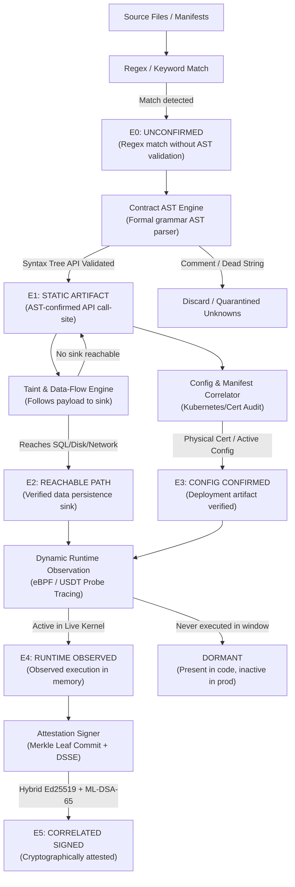

# ECDAT Specification: Evidence-Based (E0–E5) and Level-Based (CAMS L0–L5) Scanning

## Executive Summary

Enterprise post-quantum cryptographic remediation requires evaluating two orthogonal dimensions for every discovered cryptosystem:

1. **Evidence-Based Scanning (Epistemic Certainty):** *How confident are we that this cryptographic asset exists, is reachable in code, is configured in deployment, and is actively invoked in production?*  
   ECDAT models this via the **E0–E5 State Taxonomy**, preventing the catastrophic false-positive fatigue that plagues conventional regex scanners while providing cryptographically verifiable inclusion proofs.
2. **Level-Based Scanning (Architectural Agility):** *How difficult and costly is it for developers to swap this cryptographic primitive out when emergency quantum migration is mandated?*  
   ECDAT models this via the **Cryptographic Agility Maturity Scale (CAMS L0–L5)**, directly parameterizing the code-migration effort multiplier ($Y_{\text{code}}$) in the Mosca Quantum Risk Inequality.

This specification details the **data models**, **control flows**, and **concrete source code examples** for both paradigms.

---

## Comparative Taxonomy Matrix

```
                      EVIDENCE-BASED SCANNING (E0–E5)
                      "Epistemic Confidence & Reachability"
                                      │
  E0: Keyword Match   ──► E1: AST Syntax  ──► E2: Dataflow Sink ──► E3: Config ──► E4: Runtime ──► E5: DSSE Signed
  (Regex unverified)     (Method verified)   (SQL/Disk sink)       (Cert/YAML)    (eBPF kernel)    (Merkle proof)
                                      ▲
                                      │  ORTHOGONAL EVALUATION
                                      ▼
  L0: Rigid Literals  ──► L1: Config Keys ──► L2: Provider SPI  ──► L3: Handshake ──► L4: KMS/Tink ──► L5: PQC Native
  (String in code)       (Properties/Env)    (JCE/OpenSSL)         (TLS Negotiated)  (Orchestrated)   (ML-KEM/ML-DSA)
                                      │
                         LEVEL-BASED SCANNING (CAMS L0–L5)
                      "Architectural Swap Friction & Agility"
```

---

# Part 1: Evidence-Based Scanning (E0–E5 Taxonomy)

Conventional Software Composition Analysis (SCA) tools rely on superficial regular expressions or static package dependencies, generating either bloated inventories of dead test code or failing to prove that an unencrypted credential reaches disk.

ECDAT replaces heuristic guesswork with a **formal 6-stage epistemic verification lattice** aligning with emerging **CycloneDX 1.6 Cryptographic BOM (CBOM) Discussion #966** standards.

---

## 1.1 Data Model & Schemas

### Python Data Model ([`ecdat/models.py`](file:///home/mohmedh/personal/ECDAT/ecdat/models.py))

```python
class EvidenceLevel(str, Enum):
    """
    E0–E5 State Taxonomy:
    Tracks epistemic confidence and verification stages for discovered cryptographic assets.
    """
    E0_UNCONFIRMED       = "E0_UNCONFIRMED"         # Regex / string / keyword match only
    E1_STATIC_ARTIFACT   = "E1_STATIC_ARTIFACT"     # AST-confirmed API invocation
    E2_REACHABLE_PATH    = "E2_REACHABLE_PATH"       # Confirmed reachable via static call-graph / data-flow
    E3_CONFIG_CONFIRMED  = "E3_CONFIG_CONFIRMED"     # Deployment config / certificate file on disk
    E4_RUNTIME_OBSERVED  = "E4_RUNTIME_OBSERVED"     # Dynamically observed executing at runtime (eBPF)
    E5_CORRELATED_SIGNED = "E5_CORRELATED_SIGNED"   # Multi-source verified + cryptographically signed
    DORMANT              = "DORMANT"                 # Static asset not observed during runtime coverage window
```

### CycloneDX 1.6 Reachability Proof JSON Schema ([`ecdat/attestation/cyclonedx_966.py`](file:///home/mohmedh/personal/ECDAT/ecdat/attestation/cyclonedx_966.py))

```json
{
  "reachabilityProof": {
    "evidenceLevel": "E2_REACHABLE_PATH",
    "reachabilityType": "STATIC_AST_FORWARD_FLOW",
    "callLocation": "activemq-client/src/main/java/org/apache/activemq/broker/CompatibleSslContext.java:139",
    "confirmedSinks": [
      "java.sql.PreparedStatement.setString",
      "org.apache.activemq.store.kahadb.disk.page.Transaction.write"
    ],
    "intentClassification": "CONFIDENTIALITY_ENVELOPE",
    "verificationTimestamp": "2026-09-26T16:03:50Z"
  },
  "properties": [
    { "name": "ecdat:evidence_level", "value": "E2_REACHABLE_PATH" },
    { "name": "ecdat:cdx966:reachability", "value": "STATIC_REACHABLE" }
  ]
}
```

---

## 1.2 Control Flow & State Promotion Engine

An asset enters the pipeline at **E0** and is elevated through rigorous mathematical and static verification:



---

## 1.3 Granular Evidence Tiers & Concrete Examples

### Tier E0: Unconfirmed Regex Match
* **Definition:** Pure pattern heuristic without grammar awareness (e.g. matching `DES` or `RSA` inside a comment, variable name, or test dataset).
* **Control Action:** Quarantined or queued for AST validation. Never published directly to the production CBOM to prevent false alarm fatigue.
* **Source Example:**
  ```java
  // Inactive comment or variable name in UserDTO.java
  public class UserDTO {
      // Legacy note: We used to use RSA-1024 here before the 2021 refactor
      private String rsaPublicKeyLegacyString;
  }
  ```

### Tier E1: Static Artifact (AST Confirmed)
* **Definition:** The AST engine parses the grammar tree and proves an explicit invocation of a cryptographic API (e.g., `Cipher.getInstance`, `MessageDigest.getInstance`).
* **Control Action:** Recorded in CBOM as a static asset. Assigned default baseline risk.
* **Source Example:**
  ```java
  // AST confirms MethodInvocation to standard Java Cryptography Architecture (JCA)
  import javax.crypto.Cipher;
  
  public class EncryptionUtil {
      public byte[] encryptPayload(byte[] data, Key key) throws Exception {
          Cipher cipher = Cipher.getInstance("AES/CBC/PKCS5Padding"); // Line 42
          cipher.init(Cipher.ENCRYPT_MODE, key);
          return cipher.doFinal(data);
      }
  }
  ```
* **ECDAT Detection AST Event:**
  ```json
  {
    "event_type": "INFERRED_ALGORITHM_SPI",
    "call_signature": "javax.crypto.Cipher.getInstance(java.lang.String)",
    "line_number": 42,
    "algorithm": "AES-128-CBC",
    "evidence_level": "E1_STATIC_ARTIFACT"
  }
  ```

### Tier E2: Reachable Path (Taint & Data-Flow Confirmed)
* **Definition:** Inter-procedural data-flow analysis proves that ciphertext produced by an E1 invocation is transmitted over a socket or written to a persistent database/disk sink.
* **Control Action:** Triggers autonomous $X$-lifespan calculation ($X_{\text{eff}}$) based on the database column's schema retention policy.
* **Source Example:**
  ```java
  public class BillingService {
      public void recordCard(String cardNumber, Key key) throws Exception {
          byte[] enc = EncryptionUtil.encryptPayload(cardNumber.getBytes(), key);
          
          // ECDAT Taint Engine traces 'enc' into persistent database sink:
          PreparedStatement stmt = connection.prepareStatement(
              "INSERT INTO customer_vault (enc_cc, created_at) VALUES (?, NOW())"
          );
          stmt.setBytes(1, enc); // SINK CONFIRMED: Column 'enc_cc' has 5-year retention
          stmt.executeUpdate();
      }
  }
  ```
* **CBOM Reachability Evidence:**
  ```json
  {
    "evidenceLevel": "E2_REACHABLE_PATH",
    "reachabilityType": "STATIC_AST_FORWARD_FLOW",
    "confirmedSinks": ["customer_vault.enc_cc (PostgreSQL Archival Sink)"]
  }
  ```

### Tier E3: Configuration Confirmed
* **Definition:** Cryptographic material or cipher suite bindings verified directly within active deployment configurations (Kubernetes Ingress, Helm YAML, Nginx SSL configs, or on-disk X.509 PEM certificates).
* **Control Action:** Evaluates network exposure ($P_{\text{HNDL}}$: `PUBLIC=1.0`, `INTERNAL=0.05`, `AIRGAPPED=0.0`).
* **Source Example:**
  ```yaml
  # ingress-tls.yaml
  apiVersion: networking.k8s.io/v1
  kind: Ingress
  metadata:
    name: public-api-gateway
  spec:
    tls:
    - hosts:
      - api.enterprise.com
      secretName: legacy-rsa-tls-cert # Physical certificate on disk
  ```

### Tier E4: Runtime Observed (eBPF / Dynamic Probe)
* **Definition:** Dynamic kernel or runtime instrumentation (eBPF tracepoint, USDT probe, or Java agent) captures the execution of the call site in live process memory.
* **Control Action:** Promotes component status to `ACTIVE`. Any asset not observed during the monitoring window is flagged as `DORMANT`.
* **eBPF Observation Record:**
  ```json
  {
    "probe_type": "uprobe_libcrypto_EVP_EncryptInit",
    "pid": 48438,
    "binary": "/usr/lib/x86_64-linux-gnu/libcrypto.so.3",
    "cipher_nid": 419,
    "cipher_name": "AES-256-GCM",
    "timestamp_ns": 1790436854784,
    "evidence_level": "E4_RUNTIME_OBSERVED"
  }
  ```

### Tier E5: Correlated & Signed Attestation
* **Definition:** The asset has been cross-verified across AST syntax, dataflow sink, configuration, and dynamic runtime, and its cryptographic inclusion leaf has been committed into the in-toto DSSE attestation envelope signed with NIST FIPS 204 ML-DSA-65.
* **Control Action:** Zero-knowledge proof generation (`proof_asset_x.json`) for independent auditor compliance without disclosing internal source code.
* **DSSE Signature Record:**
  ```json
  {
    "evidenceLevel": "E5_CORRELATED_SIGNED",
    "merkleLeafHash": "0x4d42012d48c8b...",
    "rootAttestation": "0x8e407f1ec10d5a1697aceceea4b8e22cca8066aba072a700d90673946fe3b404",
    "signer": "ML-DSA-65 (NIST FIPS 204 Post-Quantum Hybrid)"
  }
  ```

---

# Part 2: Level-Based Scanning (CAMS L0–L5 Taxonomy)

While evidence-based scanning determines the *reality* of a risk, **level-based scanning** determines the *cost of fixing it*.

In Mosca’s inequality:
$$\text{Migration Deadline } Y_{\max} = (Z_{\text{reg}} - 2026) - X_{\text{eff}}$$
The actual developer migration time required is $Y_{\text{code}}$. If an application has hardcoded algorithm strings scattered across 500 microservices, $Y_{\text{code}}$ can span multiple years. If the application uses a dynamic crypto provider facade, $Y_{\text{code}}$ is reduced by up to **95%**.

ECDAT measures this through the **Cryptographic Agility Maturity Scale (CAMS L0–L5)**.

---

## 2.1 Data Model & Discount Multipliers

### CAMS Enum & Urgency Multipliers ([`ecdat/models.py`](file:///home/mohmedh/personal/ECDAT/ecdat/models.py) & [`ecdat/constants.py`](file:///home/mohmedh/personal/ECDAT/ecdat/constants.py))

```python
class AgilityLevel(int, Enum):
    """
    Cryptographic Agility Maturity Scale (CAMS) Levels 0–5:
    Measures ease of replacing cryptographic algorithms at the call-site.
    """
    RIGID          = 0  # Level 0: Hardcoded string literals, inflexible primitives
    CONFIGURABLE   = 1  # Level 1: Parameterized configs/env vars/variables
    PROVIDER       = 2  # Level 2: Pluggable crypto provider abstraction (JCE/OpenSSL)
    RUNTIME_AGILE  = 3  # Level 3: Dynamic protocol negotiation / TLS handshake
    ORCHESTRATED   = 4  # Level 4: Centralized policy orchestration / Tink / KMS
    QUANTUM_AGILE  = 5  # Level 5: Quantum-autonomous / post-quantum native
```

### Agility Discount & Effort Multiplier Table

| CAMS Level | Designation | $Y_{\text{code}}$ Multiplier | Urgency Discount | Technical Definition |
|---|---|---|---|---|
| **L0** | **RIGID** | `1.00` | `0.0%` | Hardcoded string literals; requires code refactoring, rebuild, regression test, and deployment. |
| **L1** | **CONFIGURABLE** | `0.70` | `30.0%` | Algorithm name loaded from `.env`, YAML, JSON, or system property; requires restart. |
| **L2** | **PROVIDER** | `0.40` | `60.0%` | Abstracted behind factory interface (JCE Provider, PKCS#11, OpenSSL engine). |
| **L3** | **RUNTIME_AGILE** | `0.15` | `85.0%` | Dynamic protocol negotiation during runtime handshake (TLS 1.3 `KeyShare` / `SignatureAlgorithms`). |
| **L4** | **ORCHESTRATED** | `0.10` | `90.0%` | Centralized cryptographic policy orchestration (Google Tink `KeysetHandle`, AWS KMS, HashiCorp Vault). |
| **L5** | **QUANTUM_AGILE** | `0.05` | `95.0%` | Post-quantum native (ML-KEM, ML-DSA, SLH-DSA) or automated hybrid dual-signature architecture. |

---

## 2.2 Control Flow & AST Classification Engine

```mermaid
flowchart TD
    ASTCall["AST Cryptographic Call Site\n(e.g., Cipher.getInstance(arg))"] --> Q_Check{"Is algorithm already\nPQC native?\n(ML-KEM, ML-DSA, Dilithium)"}
    
    Q_Check -->|Yes| L5["CAMS Level 5: QUANTUM_AGILE\n(Autonomous PQC / Zero Refactoring)"]
    Q_Check -->|No| Orch_Check{"Uses centralized KMS or\npolicy wrapper?\n(Tink, KeysetHandle, Vault, KMS)"}

    Orch_Check -->|Yes| L4["CAMS Level 4: ORCHESTRATED\n(Policy-driven enterprise facade)"]
    Orch_Check -->|No| Proto_Check{"Dynamic Handshake / Negotiation?\n(SSLEngine, SignatureAlgorithms, TLS)"}

    Proto_Check -->|Yes| L3["CAMS Level 3: RUNTIME_AGILE\n(Multi-algorithm runtime negotiation)"]
    Proto_Check -->|No| Prov_Check{"Uses Pluggable Provider / Factory?\n(Security.addProvider, JCE SPI, DI Bean)"}

    Prov_Check -->|Yes| L2["CAMS Level 2: PROVIDER\n(Provider drop-in replacement)"]
    Prov_Check -->|No| Param_Check{"Is call argument a variable / config?\n(config.get, env, properties)"}

    Param_Check -->|Yes| L1["CAMS Level 1: CONFIGURABLE\n(Config change without recompilation)"]
    Param_Check -->|No (String Literal)| L0["CAMS Level 0: RIGID\n(Hardcoded literal, high refactoring friction)"]
```

---

## 2.3 Granular CAMS Levels & Concrete Code Examples

### Level 0: RIGID (Hardcoded Literals)
* **Code Example (Java):**
  ```java
  // CAMS Level 0: String literal hardcoded into call-site
  public class LegacyCrypto {
      public Cipher createCipher() throws Exception {
          // Upgrading to ML-KEM or AES-256 requires editing code, recompiling, and releasing
          return Cipher.getInstance("AES/CBC/PKCS5Padding"); 
      }
  }
  ```
* **AST Evaluation:** Argument node type is `Literal(value="AES/CBC/PKCS5Padding")`. `is_literal_arg = True`.
* **CAMS Result:** `AgilityLevel.RIGID (L0)`. Effort Multiplier: `1.0`.

---

### Level 1: CONFIGURABLE (Parameter / Settings Driven)
* **Code Example (Java):**
  ```java
  // CAMS Level 1: Algorithm loaded dynamically from external properties
  public class ConfigurableCrypto {
      public Cipher createCipher(Properties props) throws Exception {
          String algo = props.getProperty("security.cipher.algorithm", "AES/GCM/NoPadding");
          // Migration only requires updating application.properties: security.cipher.algorithm=ML-KEM-768
          return Cipher.getInstance(algo);
      }
  }
  ```
* **AST Evaluation:** Argument node type is `Name(id="algo")` or `MethodInvocation(props.getProperty)`. `is_param_arg = True`.
* **CAMS Result:** `AgilityLevel.CONFIGURABLE (L1)`. Effort Multiplier: `0.70` (30% discount).

---

### Level 2: PROVIDER (Pluggable Factory / JCE / OpenSSL)
* **Code Example (Java):**
  ```java
  // CAMS Level 2: Abstracted behind pluggable security provider
  public class ProviderCrypto {
      public Cipher createCipher() throws Exception {
          // Upgrading can be accomplished by registering BouncyCastlePQC provider at startup
          return Cipher.getInstance("Kyber768", Security.getProvider("BCPQC"));
      }
  }
  ```
* **AST Evaluation:** Invocation passes explicit provider argument (`Security.getProvider` or JCE provider parameter).
* **CAMS Result:** `AgilityLevel.PROVIDER (L2)`. Effort Multiplier: `0.40` (60% discount).

---

### Level 3: RUNTIME_AGILE (Handshake Negotiation)
* **Code Example (Java / TLS):**
  ```java
  // CAMS Level 3: Runtime protocol and cipher suite negotiation
  public class DynamicTlsBroker {
      public void configureSocket(SSLSocket socket) {
          // Dynamic client-server negotiation over TLS 1.3 KeyShare / SignatureAlgorithms
          socket.setEnabledProtocols(new String[] { "TLSv1.3", "TLSv1.2" });
          socket.setEnabledCipherSuites(new String[] {
              "TLS_AES_256_GCM_SHA384",
              "TLS_CHACHA20_POLY1305_SHA256"
          });
      }
  }
  ```
* **AST Evaluation:** Invocation matches `RUNTIME_NEGOTIATED_TOKENS` (`SSLSocket`, `setEnabledCipherSuites`, `SignatureAlgorithms`).
* **CAMS Result:** `AgilityLevel.RUNTIME_AGILE (L3)`. Effort Multiplier: `0.15` (85% discount).

---

### Level 4: ORCHESTRATED (Centralized Policy / Google Tink / KMS)
* **Code Example (Java / Google Tink):**
  ```java
  // CAMS Level 4: Orchestrated Cryptographic Keysets
  import com.google.crypto.tink.Aead;
  import com.google.crypto.tink.KeysetHandle;
  
  public class OrchestratedCryptoService {
      private final KeysetHandle keysetHandle;
      
      public OrchestratedCryptoService(KeysetHandle keysetHandle) {
          this.keysetHandle = keysetHandle;
      }
      
      public byte[] encrypt(byte[] plaintext, byte[] aad) throws Exception {
          // Application code has zero algorithm awareness.
          // Cryptographic migration is performed out-of-band by rotating the Keyset in KMS.
          Aead aead = keysetHandle.getPrimitive(Aead.class);
          return aead.encrypt(plaintext, aad);
      }
  }
  ```
* **AST Evaluation:** Call site references `KeysetHandle`, `Aead.class`, or enterprise KMS wrappers (`AWSKMSClient`, `VaultTransit`).
* **CAMS Result:** `AgilityLevel.ORCHESTRATED (L4)`. Effort Multiplier: `0.10` (90% discount).

---

### Level 5: QUANTUM_AGILE (Post-Quantum Native)
* **Code Example (Node.js / Dilithium & ML-KEM):**
  ```javascript
  // CAMS Level 5: NIST FIPS 204 Native Post-Quantum Implementation
  const { ml_dsa65 } = require('@noble/post-quantum/ml-dsa');
  
  class QuantumIdentitySigner {
      signBallot(messageHash, privateKey) {
          // Cryptosystem natively satisfies NIST Level 5 post-quantum standards
          return ml_dsa65.sign(privateKey, messageHash);
      }
  }
  ```
* **AST Evaluation:** Algorithm identifier matches `PQC_AGILITY_TOKENS` (`ML-DSA`, `ML-KEM`, `Dilithium`, `Kyber`).
* **CAMS Result:** `AgilityLevel.QUANTUM_AGILE (L5)`. Effort Multiplier: `0.05` (95% discount).

---

# Part 3: The 2D Orthogonal Matrix (Evidence vs. Agility)

Every asset discovered by ECDAT is placed in the **2D Orthogonal Governance Matrix**:

| | **L0: Rigid** | **L1: Configurable** | **L2: Provider** | **L3: Negotiated** | **L4: Orchestrated** | **L5: Quantum Agile** |
|---|---|---|---|---|---|---|
| **E1: Static Syntax** | **High Tech Debt**<br/>Hardcoded in code, persistence unknown. | **Low Risk**<br/>Config-driven, persistence unknown. | **Low Risk**<br/>Provider-driven, persistence unknown. | **Moderate**<br/>Protocol declared in static code. | **Managed**<br/>Tink/KMS code, persistence unknown. | **Compliant**<br/>PQC syntax found in repository. |
| **E2: Reachable Path** | **CRITICAL ACTION**<br/>Hardcoded legacy cipher storing real customer data! | **URGENT**<br/>Active data sink; update config file immediately. | **PRIORITIZED**<br/>Active data sink; register new provider. | **CONTROLLED**<br/>Active pipeline with multi-cipher fallback. | **MINIMAL EFFORT**<br/>Rotate keyset in central KMS console. | **SAFE**<br/>PQC protecting active persistence sink. |
| **E3: Config Confirmed** | **HIGH EXPOSURE**<br/>Hardcoded certificate on public load balancer. | **CONFIG PATCH**<br/>Update YAML ingress annotations. | **PROVIDER UPDATE**<br/>Deploy modern HSM/Provider container. | **AUTOMATED**<br/>Server negotiates modern TLS clients. | **GOVERNED**<br/>Orchestration engine handles deployment. | **QUANTUM PROOF**<br/>PQC certificate active in production. |
| **E4: Runtime Observed** | **MAXIMUM DANGER**<br/>Active in live memory; zero agility; cannot hot-swap. | **HOT-RELOADABLE**<br/>Active in memory; trigger configuration reload. | **MODULAR REPLACEMENT**<br/>Active in memory; swap JCE JAR dynamically. | **DYNAMIC ADAPTATION**<br/>Live handshake negotiating cipher suites. | **ZERO DOWNTIME**<br/>KMS handles seamless rollover. | **PRODUCTION READY**<br/>PQC actively executing in production kernel. |
| **DORMANT** | **TECHNICAL DEBT**<br/>Dead hardcoded code; purge during cleanup. | **LOW PRIORITY**<br/>Unused configurable subsystem. | **LOW PRIORITY**<br/>Unused provider binding. | **INACTIVE**<br/>Negotiation code never reached by traffic. | **DORMANT WRAPPER**<br/>Unused KMS keyset binding. | **READY RESERVE**<br/>PQC compiled but awaiting traffic enablement. |

---

# Part 4: CLI & CI/CD Verification Commands

### 1. Generating CycloneDX 1.6 CBOM with E0–E5 & CAMS Attributes
```bash
python -m ecdat.pipeline scan \
    --target /path/to/enterprise-repo \
    --output ./audit-output \
    --format cyclonedx \
    --scan-libraries
```

### 2. Inspecting Evidence & Agility Distribution via Python CLI
```python
import json

cbom = json.load(open("./audit-output/cbom.json"))
for comp in cbom.get("components", []):
    name = comp["name"]
    reachability = comp.get("reachabilityProof", {})
    ev_level = reachability.get("evidenceLevel", "E1_STATIC_ARTIFACT")
    cams_prop = next((p["value"] for p in comp.get("properties", []) if p["name"] == "ecdat:cams_level"), "L0")
    print(f"[{ev_level}] [{cams_prop}] -> {name} ({comp.get('cryptoProperties', {}).get('algorithmProperties', {}).get('name')})")
```

### 3. Cryptographically Verifying E5 Attestation Envelope
```bash
# Independent auditor verification of the Ed25519 DSSE signed envelope
python -m ecdat.attestation.verifier \
    --envelope ./audit-output/attestation.dsse.json \
    --pubkey ./audit-output/attestation_pubkey.pem
```

### 4. Verifying Selective Merkle Inclusion Proof (Auditor Zero-Knowledge Proof)
```bash
# Verifies a single asset's cryptographic validity against the committed CBOM root
python -m ecdat.merkle.verifier \
    --proof ./audit-output/proofs/proof_asset_1.json \
    --root ./audit-output/cbom_root.hex
```
