# ECDAT Architecture: Flowchart & Core Concepts

This document provides:
1. **End-to-End System Flowchart:** Detailed mapping from codebase inputs through ECDAT's core analysis algorithms to compliance and migration outputs.
2. **Concept Disambiguation:** In-depth explanation of the distinct roles played by **Shadow Cryptography** vs. the **Cryptographic Supply Chain** on the security dashboard.

---

## 1. End-to-End System Flowchart (Input $\rightarrow$ Algorithm $\rightarrow$ Output)

```mermaid
flowchart TD
    subgraph Inputs ["1. AUDITED CODEBASE INPUTS"]
        A1["Polyglot Source Code<br/>• Java (.java)<br/>• JavaScript / TypeScript (.js, .ts)<br/>• Python (.py)<br/>• Go (.go)<br/>• Rust (.rs)<br/>• Ruby (.rb)"]
        A2["Dependency Manifests<br/>• Maven (pom.xml)<br/>• Node (package.json)<br/>• Python (requirements.txt, pyproject.toml)<br/>• Go (go.mod)<br/>• Cargo (Cargo.toml)"]
        A3["Deployment Infrastructure<br/>• Kubernetes YAML (Ingress, Services)<br/>• Container Specs (Dockerfile)<br/>• Server TLS Configs (Nginx, Envoy)"]
    end

    subgraph ECDAT ["2. ECDAT CORE ANALYSIS ALGORITHMS"]
        B1["Contract AST Engine<br/>• Zero-regex formal grammar parsing<br/>• AST visitor & method invocation contracts<br/>• Literal propagation & parameter resolution"]
        B2["DSIS Intent Classifier<br/>• Functional security lattice<br/>• Separates Operational Utility (ETags/Caches)<br/>  from Confidentiality & Identity Signatures"]
        B3["X-Dataflow Lifespan Inference Engine<br/>• Autonomous SQL / ORM schema correlation<br/>• 4-Tier data secrecy classification<br/>  (Ephemeral, Short-Term, Operational, Archival)"]
        B4["CAMS Agility & Buffer Hazard Audit<br/>• CAMS L0 (Rigid) to L3 (Runtime-Agile) scoring<br/>• Static byte allocation vs. ML-DSA / ML-KEM expansion<br/>• Buffer overflow hazard identification"]
        B5["Stochastic Mosca Quantum Risk Engine<br/>• Classical Mosca inequality: Y_max = (Z_reg - 2026) - X_eff<br/>• Monte Carlo stochastic breach probability (5,000 runs)<br/>• Calibrated against GRI 2025 Quantum Threat Report"]
        B6["Epidemiological R0 Contagion & Pareto Optimizer<br/>• Software dependency contact network modeling<br/>• Superspreader hub detection (R0 score)<br/>• Knapsack portfolio: Maximize risk reduction (ΔR) within dev-weeks budget"]
        B7["Privacy-Preserving Attestation Signer<br/>• Merkle leaf commitments (SHA-256)<br/>• In-toto v1.0 Statement & RFC 9162 DSSE Envelope<br/>• Hybrid Ed25519 + ML-DSA-65 post-quantum signature"]
    end

    subgraph Outputs ["3. EXECUTIVE & COMPLIANCE OUTPUTS"]
        C1["CycloneDX 1.6 Cryptographic BOM (CBOM)<br/>• JSON format with cryptoProperties<br/>• NIST OIDs, key sizes, algorithms, and evidence states (E0-E5)"]
        C2["CISO Executive Migration Briefing (Markdown)<br/>• Prioritized Y_max remediation backlog<br/>• CAMS effort multipliers & compliance milestones (NIST IR 8547)"]
        C3["SLSA / in-toto Signed Attestation (attestation.dsse.json)<br/>• Non-malleable cryptographic proof of scan integrity<br/>• Negative Proof Certificate (zero unquarantined vulnerabilities)"]
        C4["Interactive Web Dashboard & Airgapped Report<br/>• Standalone report.html + real-time multi-project web app<br/>• D3.js Contagion Graph, Pareto slider, Monte Carlo density curves"]
        C5["Selective Auditor Merkle Proofs (proof_asset_x.json)<br/>• Zero-knowledge inclusion verification<br/>• Verifies single asset without exposing proprietary codebase paths"]
    end

    Inputs --> B1
    Inputs --> B2
    Inputs --> B3
    B1 --> B3
    B2 --> B3
    B3 --> B4
    B4 --> B5
    B5 --> B6
    B6 --> B7
    B7 --> Outputs
```

### Detailed Execution Stages:

1. **Codebase Ingestion (Inputs):**
   - The scanner operates statically on raw disk directories. No compilation, external network access, or runtime instrumentation is required.
   - Discovers application code, configuration files, and package lockfiles across all major enterprise ecosystems.

2. **Analysis Pipeline (ECDAT Algorithm):**
   - **Stage 1 (Contract AST Engine):** Tokenizes and parses source files using language-specific formal grammars (e.g. `ljavalang` for Java, native `ast` for Python). Maps method calls (`Cipher.getInstance`, `MessageDigest.getInstance`) against cryptographic contracts with zero regular expressions.
   - **Stage 2 (DSIS Intent Classification):** Applies the Directed Security Intent Spectrum (DSIS) to distinguish operational utility hashes (MD5 in cache keys, SHA-1 in ETags) from true security controls (passwords, JWT tokens, TLS handshakes).
   - **Stage 3 ($X$-Dataflow Inference):** Tracks how long encrypted payloads persist across storage tiers ($X_{\text{eff}}$), leveraging database schema migrations, TTL configurations, and retention policies.
   - **Stage 4 (CAMS & Buffer Hazard Engine):** Scores cryptographic agility from L0 (hardcoded strings) to L3 (policy-driven agile facades) and audits fixed-size buffer allocations (e.g. 64-byte buffers that will overflow when receiving 3,293-byte ML-DSA-65 signatures).
   - **Stage 5 (Stochastic Mosca Inequality):** Evaluates $Y_{\max} = (Z_{\text{reg}} - 2026) - X_{\text{eff}}$ and simulates 5,000 Monte Carlo trajectories to compute Value-at-Risk (VaR 95%) and breach probabilities.
   - **Stage 6 (Contagion & Pareto Optimization):** Maps how vulnerable crypto propagates through internal dependencies to identify superspreader nodes ($R_0 > 1.0$), then optimizes remediation scheduling under sprint budget constraints.
   - **Stage 7 (Attestation Signing):** Commits all discovered assets to a SHA-256 Merkle tree and generates an in-toto DSSE attestation signed with an Ed25519 + ML-DSA-65 hybrid key.

3. **Deliverables (Outputs):**
   - Generates production-ready artifacts: standard CycloneDX 1.6 CBOM, executive Markdown reports, signed DSSE envelopes, selective inclusion proofs, and self-contained HTML5 reports.

---

## 2. Concept Comparison: "Shadow Cryptography" vs. "Cryptographic Supply Chain"

On the ECDAT dashboard, **Shadow Cryptography** and the **Cryptographic Supply Chain** address two completely distinct threat surfaces. 

| Evaluation Dimension | **Shadow Cryptography (Auditable Unknowns Ledger)** | **Cryptographic Supply Chain (Vendor & Dependency Blast Radius)** |
|---|---|---|
| **Threat Surface** | **Internal Proprietary Source Code & Scanning Boundaries** | **External Third-Party Packages & Upstream Dependencies** |
| **Fundamental Question** | *"What unvetted, custom, obscured, or unmanaged crypto is buried inside our proprietary code?"* | *"What cryptographic risk and vulnerabilities are we importing from external packages and vendors?"* |
| **Target Artifacts** | • Application source files (.java, .py, .js, .go, .rs) • Hardcoded strings and static arrays • Dynamic reflection invocations (`Class.forName`) • Custom obfuscation / XOR loops • Opaque binary containers (.p12, .jks, .bin) • Excluded scanning perimeter directories | • Package manifests (`package.json`, `pom.xml`, `go.mod`, `Cargo.toml`) • Transitive open-source libraries • Upstream cryptographic providers (BouncyCastle, OpenSSL bindings, WebCrypto wrappers) • Vendor package registries (npm, Maven Central, PyPI) |
| **Detection Method** | • Shannon entropy calculation ($H \ge 4.5$ bits/byte) • AST control-flow pattern matching (custom math loops) • Lexer-driven boundary auditing (logging skipped directories) • Unresolvable runtime reflection detection | • Manifest dependency tree resolution • Cryptographic capabilities cataloging (PQC vs. Classical) • Known CVE / CWE advisory correlation • SLSA provenance level verification • Transitive $R_0$ blast radius graph traversal |
| **Core Engineering Philosophy** | **Auditable Boundary Honesty:** Conventional scanners falsely claim "100% clean" by silently ignoring files they cannot parse. ECDAT declares and quarantines all unknowns, unparsed blobs, and dynamic calls in a tamper-evident ledger. | **Upstream Trust & Transitive Quantum Exposure:** Even if proprietary application code is clean, an outdated upstream library (e.g. hardcoded RSA-2048 in a blockchain SDK or payment gateway) compromises the entire system. |
| **Key Dashboard Metrics** | • Quarantined Unknowns Count • High-Entropy Key Blobs • Dynamic Unresolved Call Sites • Excluded Scanning Perimeter Paths | • Total Third-Party Dependencies • Package CVE / Weakness Count • Classical-Only vs. PQC-Ready Packages • Transitive $R_0$ Blast Radius |
| **Actionable Remediation** | • Move hardcoded keys to cloud KMS / HashiCorp Vault • Replace custom XOR/math with audited standard primitives • Refactor reflection into type-safe dependency injection • Manually triage quarantined binary stores | • Upgrade vulnerable libraries to patched versions • Swap classical-only packages for post-quantum alternatives • Enforce SLSA Level 3+ provenance verification in CI/CD • Isolate high-blast-radius packages behind facades |

---

### Executive Summary for Leadership:
- **Shadow Cryptography** protects the organization from **internal blindness** (hidden, undocumented, or unmanaged crypto created by internal engineering teams).
- **Cryptographic Supply Chain** protects the organization from **external inheritance** (vulnerabilities and quantum obsolescence imported from third-party open-source packages and commercial vendors).
